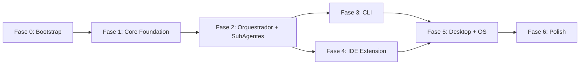

# Athion Assistent - Definicoes do Projeto

Documentacao detalhada de cada fase de implementacao do Athion Assistent.

Documento de referencia: [project-definition.md](../project-definition.md)

---

## Visao Geral do Projeto

**Athion Assistent** e um assistente de codificacao alimentado por IA com arquitetura de orquestrador + subagentes. Opera em 3 interfaces: extensao VS Code/Cursor, CLI terminal, e app desktop (Tauri).

## Timeline Total: 23 Semanas

```
Semana  1-2  ██░░░░░░░░░░░░░░░░░░░░░  Fase 0: Bootstrap
Semana  3-5  ░░███░░░░░░░░░░░░░░░░░░  Fase 1: Core Foundation
Semana  6-8  ░░░░░███░░░░░░░░░░░░░░░  Fase 2: Orquestrador + SubAgentes
Semana  9-11 ░░░░░░░░███░░░░░░░░░░░░  Fase 3: CLI Terminal
Semana 12-15 ░░░░░░░░░░░████░░░░░░░░  Fase 4: IDE Extension
Semana 16-20 ░░░░░░░░░░░░░░░█████░░░  Fase 5: Desktop + OS Integration
Semana 21-23 ░░░░░░░░░░░░░░░░░░░░███  Fase 6: Polish
```

## Mapa de Dependencias



## Indice de Fases

| Fase | Nome | Semanas | Descricao | Link |
|------|------|---------|-----------|------|
| **0** | Bootstrap | 1-2 | Setup monorepo, CI/CD, infraestrutura basica | [fase-0-bootstrap/](fase-0-bootstrap/fase-0-bootstrap.md) |
| **1** | Core Foundation | 3-5 | Config, Event Bus, Storage, Provider Layer, Tools, Permissions, Skills, Token Manager | [fase-1-core-foundation/](fase-1-core-foundation/fase-1-core-foundation.md) |
| **2** | Orquestrador + SubAgentes | 6-8 | Orchestrator, SubAgent Manager, Task Tool, Skills e Agents built-in | [fase-2-orquestrador-subagentes/](fase-2-orquestrador-subagentes/fase-2-orquestrador-subagentes.md) |
| **3** | CLI Terminal | 9-11 | Interface terminal com Ink/React, yargs, streaming, session history | [fase-3-cli/](fase-3-cli/fase-3-cli.md) |
| **4** | IDE Extension | 12-15 | Extensao VS Code/Cursor, autocomplete FIM, chat webview, indexacao | [fase-4-ide-extension/](fase-4-ide-extension/fase-4-ide-extension.md) |
| **5** | Desktop + OS Integration | 16-20 | App Tauri, system tray, hotkeys, deep links, context menus, distribuicao | [fase-5-desktop-os-integration/](fase-5-desktop-os-integration/fase-5-desktop-os-integration.md) |
| **6** | Polish | 21-23 | Testes, telemetria, docs, performance, security audit, i18n | [fase-6-polish/](fase-6-polish/fase-6-polish.md) |

## Stack Tecnologica Resumida

| Camada | Tecnologia |
|--------|-----------|
| Runtime | Bun 1.x |
| Linguagem | TypeScript 5.8+ strict |
| Build | Turborepo + Bun |
| LLM | Vercel AI SDK 5.x + adapters |
| Database | SQLite WAL + Drizzle ORM |
| CLI | yargs 18.x + Ink 6 (React) |
| IDE | VS Code Extension API |
| Desktop | Tauri 2.x + React 19 + Tailwind 4 |
| Testes | Vitest + Playwright |

## Metricas Gerais de Qualidade

- Zero God Classes (max 300 linhas/arquivo)
- 80%+ cobertura de testes no core
- SOLID score > 8/10
- OpenTelemetry em todas operacoes LLM
- Permission system ativo para todas tools
