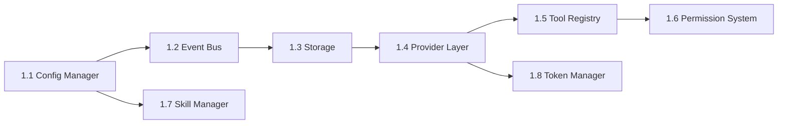

# Fase 1: Core Foundation

**Semanas**: 3-5
**Objetivo**: Implementar todos os modulos fundamentais do core engine, sem interface de usuario.
**Pre-requisitos**: Fase 0 concluida (monorepo funcional, CI rodando)
**Entregavel**: Core engine testavel via API programatica.

---

## 1. Visao Geral

Esta fase constroi o alicerce do sistema. Todos os 8 modulos aqui sao dependencias das fases seguintes. A ordem de implementacao importa — seguir o mapa de dependencias abaixo.

### Ordem de Implementacao



---

## 2. Tasks Detalhadas

### 2.1 Config Manager (Complexidade: Media)

**Origem**: OpenCode (config/config.ts) — simplificado de 7 para 5 niveis
**Path**: `packages/core/src/config/`
**Estimativa**: 2-3 dias

**Responsabilidade**: Hierarquia de configuracao com merge por precedencia.

**Hierarquia (5 niveis, do menor para maior prioridade)**:
1. **Defaults** — Built-in no codigo
2. **Global** — `~/.athion/config.json`
3. **Project** — `.athion/config.json` ou `athion.json`
4. **Environment** — `ATHION_*` variaveis
5. **CLI args** — `--model`, `--provider`, etc.

**Interface**:
```typescript
// packages/core/src/config/config.ts
import { z } from 'zod'

export const ConfigSchema = z.object({
  // LLM
  provider: z.string().default('ollama'),
  model: z.string().default('qwen2.5-coder:7b'),
  temperature: z.number().min(0).max(2).default(0.7),
  maxTokens: z.number().optional(),

  // Storage
  dataDir: z.string().default('~/.athion'),
  dbPath: z.string().optional(),

  // Permissions
  defaultPermission: z.enum(['allow', 'ask', 'deny']).default('ask'),

  // Telemetry
  telemetry: z.boolean().default(false),
  logLevel: z.enum(['debug', 'info', 'warn', 'error']).default('info'),

  // UI
  theme: z.string().default('default'),
  language: z.string().default('pt-BR'),
})

export type Config = z.infer<typeof ConfigSchema>

export interface ConfigManager {
  get<K extends keyof Config>(key: K): Config[K]
  getAll(): Readonly<Config>
  set<K extends keyof Config>(key: K, value: Config[K]): void
  reload(): void
  onChanged: (callback: (key: string, value: unknown) => void) => () => void
}
```

**Arquivos a criar**:
```
packages/core/src/config/
├── config.ts          # ConfigManager implementation (< 150 linhas)
├── schema.ts          # Zod schema + defaults (< 80 linhas)
├── loader.ts          # File/env/args loading (< 100 linhas)
└── index.ts           # barrel export
```

**Testes**:
- [ ] Merge de 5 niveis funciona (default < global < project < env < args)
- [ ] Zod valida e rejeita configs invalidos
- [ ] Hot reload detecta mudancas em arquivo
- [ ] Variaveis ATHION_* sao mapeadas corretamente

**Criterio de aceite**:
- [ ] `ConfigManager.get('model')` retorna valor correto por precedencia
- [ ] Config invalido gera erro descritivo
- [ ] < 150 linhas no arquivo principal

---

### 2.2 Event Bus (Complexidade: Baixa)

**Origem**: OpenCode (bus/index.ts) — copiar e ajustar naming
**Path**: `packages/core/src/bus/`
**Estimativa**: 1-2 dias

**Responsabilidade**: Comunicacao desacoplada entre modulos via pub/sub tipado com Zod.

**Interface**:
```typescript
// packages/core/src/bus/bus.ts
import { z, ZodType } from 'zod'

export interface BusEventDef<T extends ZodType> {
  type: string
  schema: T
}

export function defineBusEvent<T extends ZodType>(
  type: string,
  schema: T
): BusEventDef<T> {
  return { type, schema }
}

export interface Bus {
  publish<T extends ZodType>(event: BusEventDef<T>, data: z.infer<T>): void
  subscribe<T extends ZodType>(
    event: BusEventDef<T>,
    handler: (data: z.infer<T>) => void
  ): () => void  // retorna unsubscribe
  once<T extends ZodType>(
    event: BusEventDef<T>,
    handler: (data: z.infer<T>) => void
  ): () => void
  clear(): void
}
```

**Eventos pre-definidos**:
```typescript
// packages/core/src/bus/events.ts
export const StreamStart = defineBusEvent('stream.start', z.object({
  sessionId: z.string(),
}))
export const StreamContent = defineBusEvent('stream.content', z.object({
  sessionId: z.string(),
  content: z.string(),
  index: z.number(),
}))
export const StreamToolCall = defineBusEvent('stream.tool_call', z.object({
  sessionId: z.string(),
  toolName: z.string(),
  args: z.unknown(),
}))
export const StreamToolResult = defineBusEvent('stream.tool_result', z.object({
  sessionId: z.string(),
  toolName: z.string(),
  result: z.unknown(),
}))
export const StreamComplete = defineBusEvent('stream.complete', z.object({
  sessionId: z.string(),
}))
export const SubagentStart = defineBusEvent('subagent.start', z.object({
  sessionId: z.string(),
  agentName: z.string(),
}))
export const SubagentProgress = defineBusEvent('subagent.progress', z.object({
  sessionId: z.string(),
  agentName: z.string(),
  data: z.unknown(),
}))
export const SubagentComplete = defineBusEvent('subagent.complete', z.object({
  sessionId: z.string(),
  agentName: z.string(),
  result: z.unknown(),
}))
export const PermissionRequest = defineBusEvent('permission.request', z.object({
  action: z.string(),
  target: z.string(),
}))
export const ConfigChanged = defineBusEvent('config.changed', z.object({
  key: z.string(),
  value: z.unknown(),
}))
```

**Arquivos**:
```
packages/core/src/bus/
├── bus.ts             # Bus implementation (< 80 linhas)
├── events.ts          # Event definitions (< 100 linhas)
└── index.ts
```

**Testes**:
- [ ] Publish + subscribe funciona
- [ ] Zod valida payload (rejeita dados invalidos)
- [ ] Unsubscribe para de receber eventos
- [ ] `once` recebe apenas 1 vez
- [ ] Multiplos subscribers no mesmo evento

**Criterio de aceite**:
- [ ] Pub/sub funcional com type safety
- [ ] Zod validation em runtime
- [ ] < 80 linhas de implementacao

---

### 2.3 Storage - SQLite WAL + Drizzle (Complexidade: Media)

**Origem**: OpenCode (storage/db.ts + Drizzle ORM)
**Path**: `packages/core/src/storage/`
**Estimativa**: 3-4 dias

**Responsabilidade**: Persistencia de sessoes, mensagens e permissoes.

**Dependencias**:
```bash
bun add drizzle-orm drizzle-kit
# bun:sqlite e nativo do Bun
```

**Schema**:
```typescript
// packages/core/src/storage/schema.ts
import { sqliteTable, text, integer } from 'drizzle-orm/sqlite-core'

export const sessions = sqliteTable('sessions', {
  id: text('id').primaryKey(),
  projectId: text('project_id').notNull(),
  title: text('title'),
  createdAt: integer('created_at', { mode: 'timestamp' }).notNull(),
  updatedAt: integer('updated_at', { mode: 'timestamp' }).notNull(),
  metadata: text('metadata', { mode: 'json' }),
})

export const messages = sqliteTable('messages', {
  id: text('id').primaryKey(),
  sessionId: text('session_id').references(() => sessions.id, { onDelete: 'cascade' }),
  role: text('role', { enum: ['user', 'assistant', 'system', 'tool'] }).notNull(),
  parts: text('parts', { mode: 'json' }).notNull(),
  createdAt: integer('created_at', { mode: 'timestamp' }).notNull(),
})

export const permissions = sqliteTable('permissions', {
  id: text('id').primaryKey(),
  action: text('action').notNull(),
  target: text('target'),
  decision: text('decision', { enum: ['allow', 'ask', 'deny'] }).notNull(),
  scope: text('scope', { enum: ['once', 'session', 'remember'] }).notNull(),
  createdAt: integer('created_at', { mode: 'timestamp' }).notNull(),
})
```

**Database Manager**:
```typescript
// packages/core/src/storage/db.ts
export interface DatabaseManager {
  // Sessions
  createSession(projectId: string, title?: string): Promise<Session>
  getSession(id: string): Promise<Session | undefined>
  listSessions(projectId?: string): Promise<Session[]>
  updateSession(id: string, data: Partial<Session>): Promise<void>
  deleteSession(id: string): Promise<void>

  // Messages
  addMessage(sessionId: string, message: NewMessage): Promise<Message>
  getMessages(sessionId: string): Promise<Message[]>
  deleteMessages(sessionId: string): Promise<void>

  // Permissions
  getPermission(action: string, target: string): Promise<Permission | undefined>
  setPermission(permission: NewPermission): Promise<void>
  listPermissions(): Promise<Permission[]>
  deletePermission(id: string): Promise<void>

  // Lifecycle
  close(): void
  migrate(): Promise<void>
}
```

**Pragmas SQLite** (configurar na conexao):
```sql
PRAGMA journal_mode = WAL;
PRAGMA busy_timeout = 5000;
PRAGMA synchronous = NORMAL;
PRAGMA cache_size = -64000;  -- 64MB
PRAGMA foreign_keys = ON;
PRAGMA temp_store = MEMORY;
```

**Arquivos**:
```
packages/core/src/storage/
├── db.ts              # DatabaseManager implementation (< 200 linhas)
├── schema.ts          # Drizzle schema (< 80 linhas)
├── migrations/        # Drizzle migrations
│   └── 0001_initial.sql
└── index.ts
```

**Testes**:
- [ ] CRUD de sessions funciona
- [ ] CRUD de messages funciona
- [ ] CRUD de permissions funciona
- [ ] Cascade delete (deletar session deleta messages)
- [ ] WAL mode ativo (verificar pragma)
- [ ] Migrations rodam sem erro

**Criterio de aceite**:
- [ ] Database cria automaticamente no primeiro uso
- [ ] Migrations aplicam schema
- [ ] WAL + pragmas configurados
- [ ] < 200 linhas no arquivo principal

---

### 2.4 Provider Layer (Complexidade: Alta)

**Origem**: OpenCode (Vercel AI SDK) + Continue (adapters)
**Path**: `packages/core/src/provider/`
**Estimativa**: 4-5 dias

**Responsabilidade**: Abstracao unificada para multiplos provedores LLM.

**Dependencias**:
```bash
bun add ai @ai-sdk/openai @ai-sdk/anthropic @ai-sdk/google
```

**Interface**:
```typescript
// packages/core/src/provider/provider.ts
import { CoreMessage, ToolDefinition } from 'ai'

export interface StreamChatConfig {
  model: string
  provider: string
  messages: CoreMessage[]
  tools?: Record<string, ToolDefinition>
  temperature?: number
  maxTokens?: number
  signal?: AbortSignal
}

export interface ProviderLayer {
  getProvider(id: string): AIProvider
  listProviders(): ProviderInfo[]
  listModels(providerId?: string): ModelInfo[]
  streamChat(config: StreamChatConfig): AsyncGenerator<StreamEvent>
  generateObject<T>(config: ObjectConfig<T>): Promise<T>
}

export type StreamEvent =
  | { type: 'content'; content: string }
  | { type: 'tool_call'; id: string; name: string; args: unknown }
  | { type: 'tool_result'; id: string; result: unknown }
  | { type: 'finish'; usage: TokenUsage }
  | { type: 'error'; error: Error }

export interface TokenUsage {
  promptTokens: number
  completionTokens: number
  totalTokens: number
}
```

**Providers iniciais (5)**:
1. **OpenAI** — via `@ai-sdk/openai` (GPT-4o, GPT-4o-mini)
2. **Anthropic** — via `@ai-sdk/anthropic` (Claude Sonnet, Haiku)
3. **Google** — via `@ai-sdk/google` (Gemini Pro, Flash)
4. **Ollama** — via OpenAI-compatible endpoint
5. **OpenRouter** — via OpenAI-compatible endpoint

**Arquivos**:
```
packages/core/src/provider/
├── provider.ts        # ProviderLayer implementation (< 200 linhas)
├── types.ts           # Types e interfaces (< 80 linhas)
├── registry.ts        # Provider registry (< 100 linhas)
├── adapters/
│   ├── openai.ts      # OpenAI adapter (< 80 linhas)
│   ├── anthropic.ts   # Anthropic adapter (< 80 linhas)
│   ├── google.ts      # Google adapter (< 80 linhas)
│   ├── ollama.ts      # Ollama adapter (< 80 linhas)
│   └── openrouter.ts  # OpenRouter adapter (< 80 linhas)
└── index.ts
```

**Testes**:
- [ ] Streaming funciona com mock provider
- [ ] Tool calling funciona (tool_call + tool_result events)
- [ ] AbortSignal cancela stream
- [ ] Token usage retornado no finish event
- [ ] Provider nao encontrado gera erro claro

**Criterio de aceite**:
- [ ] 5 providers configurados e funcionais
- [ ] AsyncGenerator de StreamEvent funciona
- [ ] Tool calling via Vercel AI SDK
- [ ] < 200 linhas no arquivo principal

---

### 2.5 Tool Registry (Complexidade: Media)

**Origem**: OpenCode (Tool.define() + registry.ts)
**Path**: `packages/core/src/tool/`
**Estimativa**: 3-4 dias

**Responsabilidade**: Registrar, descobrir e executar tools declarativas com Zod.

**Interface**:
```typescript
// packages/core/src/tool/tool.ts
import { z, ZodType } from 'zod'

export interface ToolContext {
  sessionId: string
  checkPermission(action: string, target: string): Promise<void>
  bus: Bus
}

export interface ToolResult {
  title: string
  output: string
  metadata?: Record<string, unknown>
}

export interface ToolDefinition<T extends ZodType = ZodType> {
  name: string
  description: string
  parameters: T
  execute(args: z.infer<T>, ctx: ToolContext): Promise<ToolResult>
}

// Factory function (inspirado OpenCode)
export function defineTool<T extends ZodType>(
  name: string,
  config: {
    description: string
    parameters: T
    execute: (args: z.infer<T>, ctx: ToolContext) => Promise<ToolResult>
  }
): ToolDefinition<T> {
  return { name, ...config }
}

// Registry
export interface ToolRegistry {
  register(tool: ToolDefinition): void
  get(name: string): ToolDefinition | undefined
  list(filter?: { category?: string }): ToolDefinition[]
  execute(name: string, args: unknown, ctx: ToolContext): Promise<ToolResult>
  toAISDKTools(): Record<string, any>  // Converte para formato Vercel AI SDK
}
```

**Tools built-in a implementar nesta fase (5 basicas)**:
```typescript
// read_file
defineTool('read_file', {
  description: 'Le o conteudo de um arquivo',
  parameters: z.object({
    path: z.string(),
    offset: z.number().optional(),
    limit: z.number().optional(),
  }),
  async execute(args, ctx) { ... }
})

// write_file
// edit_file (diff-based)
// list_directory
// glob
```

**Arquivos**:
```
packages/core/src/tool/
├── tool.ts            # defineTool factory (< 50 linhas)
├── registry.ts        # ToolRegistry implementation (< 150 linhas)
├── types.ts           # Types (< 50 linhas)
├── builtin/
│   ├── read-file.ts   # (< 60 linhas)
│   ├── write-file.ts  # (< 60 linhas)
│   ├── edit-file.ts   # (< 100 linhas)
│   ├── list-dir.ts    # (< 40 linhas)
│   └── glob.ts        # (< 50 linhas)
└── index.ts
```

**Testes**:
- [ ] defineTool cria tool valida
- [ ] Registry.register + Registry.get funciona
- [ ] Registry.execute valida args com Zod (rejeita invalidos)
- [ ] toAISDKTools converte corretamente
- [ ] read_file le arquivo real
- [ ] write_file escreve arquivo
- [ ] Permission check e chamado antes da execucao

**Criterio de aceite**:
- [ ] 5 tools basicas funcionais
- [ ] Zod valida argumentos em runtime
- [ ] Conversao para Vercel AI SDK format
- [ ] < 150 linhas no registry

---

### 2.6 Permission System (Complexidade: Media)

**Origem**: OpenCode (permission/next.ts)
**Path**: `packages/core/src/permission/`
**Estimativa**: 2-3 dias

**Responsabilidade**: Controle de acesso granular para execucao de tools.

**Interface**:
```typescript
// packages/core/src/permission/permission.ts
export type PermissionDecision = 'allow' | 'ask' | 'deny'
export type PermissionScope = 'once' | 'session' | 'remember'

export interface PermissionRule {
  id: string
  action: string        // "bash", "edit", "read", "*"
  target?: string       // "/path/**", "*"
  decision: PermissionDecision
  scope: PermissionScope
}

export interface PermissionSystem {
  check(action: string, target: string): Promise<PermissionDecision>
  grant(rule: Omit<PermissionRule, 'id'>): Promise<void>
  revoke(ruleId: string): Promise<void>
  getRules(): Promise<PermissionRule[]>
  clearSession(): void  // Limpa regras scope=once e scope=session
}
```

**Logica de matching**:
1. Regras mais especificas tem prioridade (glob matching)
2. `*` matcha tudo
3. `/path/**` matcha tudo dentro do path
4. `scope=once` vale para 1 execucao
5. `scope=session` vale ate fechar a sessao
6. `scope=remember` e persistido no SQLite

**Arquivos**:
```
packages/core/src/permission/
├── permission.ts      # PermissionSystem implementation (< 150 linhas)
├── matcher.ts         # Glob matching logic (< 60 linhas)
└── index.ts
```

**Testes**:
- [ ] `check("read", "/file.ts")` retorna 'allow' se regra existe
- [ ] Glob matching funciona (`/src/**` matcha `/src/deep/file.ts`)
- [ ] Regra mais especifica ganha
- [ ] `scope=once` e removida apos uso
- [ ] `scope=remember` persiste no SQLite

---

### 2.7 Skill Manager (Complexidade: Media)

**Origem**: Qwen Code (skill-manager.ts) + OpenCode (skill.ts)
**Path**: `packages/core/src/skill/`
**Estimativa**: 2-3 dias

**Responsabilidade**: Descobrir, carregar e validar skills (SKILL.md files).

**Formato SKILL.md**:
```markdown
---
name: "code-reviewer"
description: "Revisa codigo com foco em qualidade"
tools: [read_file, grep_search, glob]
---

Voce e um revisor de codigo senior...
```

**Interface**:
```typescript
export interface Skill {
  name: string
  description: string
  tools?: string[]
  systemPrompt: string
  level: 'builtin' | 'user' | 'project'
  filePath: string
}

export interface SkillManager {
  loadSkill(name: string): Skill | undefined
  listSkills(): SkillInfo[]
  discoverSkills(): void
  validateSkill(content: string): ValidationResult
}
```

**Diretorios de descoberta**:
1. `builtin` — `packages/core/skills/` (shipped com o app)
2. `user` — `~/.athion/skills/<name>/SKILL.md`
3. `project` — `.athion/skills/<name>/SKILL.md`

**Arquivos**:
```
packages/core/src/skill/
├── skill.ts           # SkillManager implementation (< 150 linhas)
├── parser.ts          # YAML frontmatter parser (< 60 linhas)
├── validator.ts       # Validation (< 50 linhas)
└── index.ts
```

**Testes**:
- [ ] Parser extrai frontmatter + body corretamente
- [ ] Discovery encontra skills nos 3 diretorios
- [ ] Precedencia: project > user > builtin
- [ ] Validation rejeita skill sem name/description

---

### 2.8 Token Manager & Compaction Engine (Complexidade: Alta)

**Origem**: Hibrido (Qwen Code + OpenCode + Continue)
**Path**: `packages/core/src/token/`
**Estimativa**: 5-7 dias

**Responsabilidade**: Controle de tokens e compactacao de contexto, otimizado para modelos locais (4K-32K).

**Pipeline de Compaction (5 estagios)**:
1. **Truncar Tool Outputs** — Limita a 500 linhas / 20KB
2. **Prune Tool Results Antigos** — Marca como "[compactado]"
3. **Sumarizar Historico XML** — `<state_snapshot>` via LLM
4. **Drop Mensagens Antigas** — FIFO preservando ultimos 30%
5. **Emergency Truncation** — Mantém apenas system + ultima mensagem

**Interface**:
```typescript
export interface TokenManager {
  calculateBudget(contextLength: number): TokenBudget
  checkCompaction(point: CompactionPoint, messages: Message[]): Promise<Message[]>
  runCompactionPipeline(messages: Message[], budget: TokenBudget): Promise<Message[]>
  countTokens(text: string, model: string): number
  getTokenizer(model: string): Tokenizer
  checkLoop(messages: Message[]): LoopResult
}

export interface TokenBudget {
  total: number
  system: number
  history: number
  currentTurn: number
  outputReserve: number
  safety: number
}

export enum CompactionPoint {
  PRE_API = 'pre_api',
  POST_TOOL = 'post_tool',
  PERIODIC = 'periodic',
}
```

**Configuracao padrao**:
- Threshold: 65% do context window
- Output reserve: 35%
- Floor minimo: 50%
- Loop detection: tool repeat (3x), content chant (5x), LLM check (15 turns)

**Arquivos**:
```
packages/core/src/token/
├── budget.ts          # Token Budget Allocator (< 100 linhas)
├── compaction.ts      # Pipeline 5 estagios (< 200 linhas)
├── tokenizer.ts       # Multi-tokenizer registry (< 100 linhas)
├── loop.ts            # Loop detection 3 camadas (< 120 linhas)
├── truncation.ts      # Tool output truncation (< 80 linhas)
└── index.ts
```

**Testes**:
- [ ] Budget allocator distribui tokens corretamente
- [ ] Estagio 1: trunca tool outputs > 500 linhas
- [ ] Estagio 2: prune marca resultados antigos
- [ ] Estagio 4: FIFO preserva ultimos 30%
- [ ] Estagio 5: emergency mantém apenas system + last user
- [ ] Loop detection: detecta tool repeat (3x mesmo tool)
- [ ] Loop detection: detecta content chant (5x mesmo conteudo)
- [ ] Multi-tokenizer: tiktoken para GPT, fallback 4 chars/token

---

## 3. Estrutura Final da Fase 1

```
packages/core/src/
├── config/
│   ├── config.ts
│   ├── schema.ts
│   ├── loader.ts
│   └── index.ts
├── bus/
│   ├── bus.ts
│   ├── events.ts
│   └── index.ts
├── storage/
│   ├── db.ts
│   ├── schema.ts
│   ├── migrations/
│   └── index.ts
├── provider/
│   ├── provider.ts
│   ├── types.ts
│   ├── registry.ts
│   ├── adapters/
│   └── index.ts
├── tool/
│   ├── tool.ts
│   ├── registry.ts
│   ├── builtin/
│   └── index.ts
├── permission/
│   ├── permission.ts
│   ├── matcher.ts
│   └── index.ts
├── skill/
│   ├── skill.ts
│   ├── parser.ts
│   ├── validator.ts
│   └── index.ts
├── token/
│   ├── budget.ts
│   ├── compaction.ts
│   ├── tokenizer.ts
│   ├── loop.ts
│   ├── truncation.ts
│   └── index.ts
└── index.ts
```

---

## 4. Riscos Especificos

| Risco | Mitigacao |
|-------|----------|
| Vercel AI SDK nao suporta provider X | Adapter customizado com OpenAI-compatible API |
| bun:sqlite bugs | Testar extensivamente; fallback better-sqlite3 |
| Compaction perde contexto critico | Testes de qualidade de resumo; XML structured |
| Zod validation overhead em hot path | Benchmark; lazy validation se necessario |

---

## 5. Checklist de Conclusao

- [ ] Todos 8 modulos implementados e testados
- [ ] Zero arquivos > 300 linhas
- [ ] 80%+ cobertura de testes
- [ ] Imports entre modulos funcionam
- [ ] 5 providers LLM respondendo (pelo menos com mock)
- [ ] 5 tools basicas executando
- [ ] SQLite WAL + pragmas configurados
- [ ] Token compaction pipeline funcional

**Proxima fase**: [Fase 2: Orquestrador + SubAgentes](../fase-2-orquestrador-subagentes/fase-2-orquestrador-subagentes.md)
