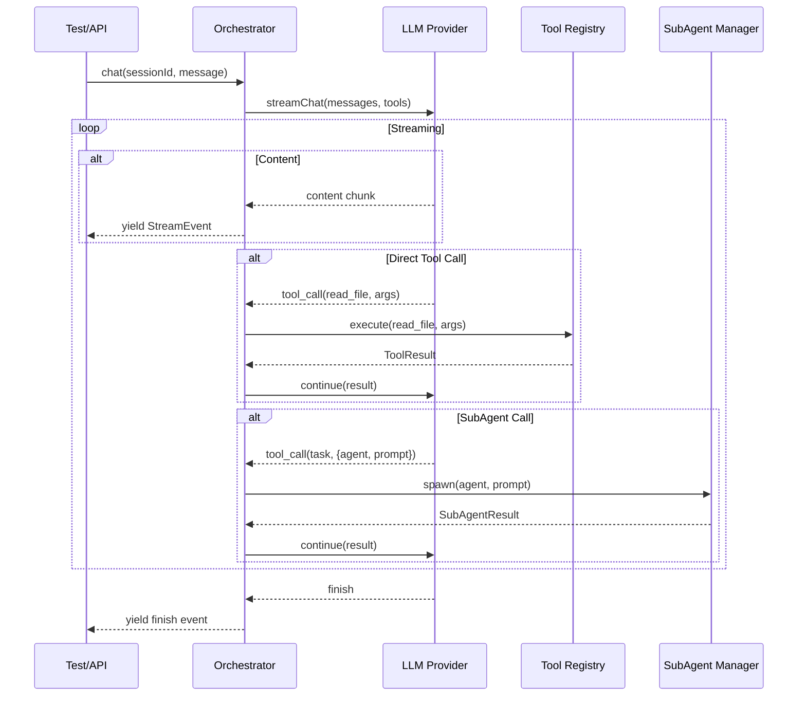

# Fase 2: Orquestrador + SubAgentes

**Semanas**: 6-8
**Objetivo**: Implementar o coracao do sistema — o orquestrador que delega para subagentes e tools.
**Pre-requisitos**: Fase 1 concluida (Config, Bus, Storage, Provider, Tools, Permissions, Skills, Token Manager)
**Entregavel**: Orquestrador funcional com subagentes via testes programaticos (sem UI).

---

## 1. Visao Geral

Esta fase implementa o "cerebro" do Athion Assistent. O orquestrador recebe mensagens, decide se usa tools diretas ou delega para subagentes, e gerencia o ciclo de streaming.

### Fluxo Principal



---

## 2. Tasks Detalhadas

### 2.1 Orchestrator (Complexidade: Alta)

**Path**: `packages/core/src/orchestrator/`
**Estimativa**: 4-5 dias

**REGRA CRITICA**: O orquestrador NUNCA deve ultrapassar 300 linhas. Toda logica complexa e delegada para servicos.

**Interface**:
```typescript
// packages/core/src/orchestrator/orchestrator.ts
export interface Orchestrator {
  chat(sessionId: string, message: UserMessage): AsyncGenerator<StreamEvent>
  createSession(projectId: string, title?: string): Promise<Session>
  loadSession(sessionId: string): Promise<Session>
  getAvailableTools(): ToolDefinition[]
  getAvailableAgents(): AgentDefinition[]
}

export interface UserMessage {
  content: string
  attachments?: Attachment[]
}

export type StreamEvent =
  | { type: 'content'; content: string }
  | { type: 'tool_call'; id: string; name: string; args: unknown }
  | { type: 'tool_result'; id: string; name: string; result: ToolResult }
  | { type: 'subagent_start'; agentName: string }
  | { type: 'subagent_progress'; agentName: string; data: unknown }
  | { type: 'subagent_complete'; agentName: string; result: unknown }
  | { type: 'finish'; usage: TokenUsage }
  | { type: 'error'; error: Error }
```

**Responsabilidades do Orchestrator (e o que NAO e)**:
| Faz | NAO faz |
|-----|---------|
| Recebe mensagem e inicia streaming | Processar tool calls (delega para ToolRegistry) |
| Gerencia ciclo de chat (loop) | Gerenciar subagentes (delega para SubAgentManager) |
| Constroi system prompt | Contar tokens (delega para TokenManager) |
| Publica eventos no Bus | Persistir dados (delega para Storage) |
| Coordena compaction | Validar permissoes (delega para PermissionSystem) |

**Arquivos**:
```
packages/core/src/orchestrator/
├── orchestrator.ts    # Orquestrador principal (MAX 300 linhas)
├── prompt-builder.ts  # Constroi system prompt + skills (< 100 linhas)
├── tool-dispatcher.ts # Despacha tool calls (< 100 linhas)
├── session.ts         # Session management helpers (< 80 linhas)
├── types.ts           # Types (< 60 linhas)
└── index.ts
```

**Pseudo-codigo do loop principal**:
```typescript
async function* chat(sessionId: string, message: UserMessage) {
  const session = await storage.getSession(sessionId)
  const messages = await storage.getMessages(sessionId)

  // Add user message
  messages.push({ role: 'user', content: message.content })
  await storage.addMessage(sessionId, { role: 'user', parts: [{ type: 'text', text: message.content }] })

  // Build system prompt
  const systemPrompt = promptBuilder.build(session, skills)

  // Compaction check
  const compacted = await tokenManager.checkCompaction('pre_api', messages)

  // Get tools (direct + task tool for subagents)
  const tools = toolRegistry.toAISDKTools()

  // Streaming loop
  while (true) {
    const stream = providerLayer.streamChat({
      model: config.get('model'),
      provider: config.get('provider'),
      messages: [{ role: 'system', content: systemPrompt }, ...compacted],
      tools,
    })

    for await (const event of stream) {
      if (event.type === 'content') {
        yield event
        bus.publish(StreamContent, { sessionId, content: event.content, index: 0 })
      }
      else if (event.type === 'tool_call') {
        yield event
        const result = await toolDispatcher.dispatch(event.name, event.args, ctx)
        yield { type: 'tool_result', id: event.id, name: event.name, result }
        // Continue with result...
      }
      else if (event.type === 'finish') {
        yield event
        break
      }
    }

    // Check if we need another turn (tool results to process)
    if (!hasPendingToolResults) break
  }

  // Save assistant message
  await storage.addMessage(sessionId, { role: 'assistant', parts: assistantParts })
}
```

**Testes**:
- [ ] Chat simples (sem tools) retorna streaming content
- [ ] Chat com tool call executa e retorna resultado
- [ ] Chat com subagent call delega para SubAgentManager
- [ ] Session e criada e mensagens sao persistidas
- [ ] Compaction roda quando necessario
- [ ] AbortSignal cancela o chat
- [ ] Erro no provider gera StreamEvent de erro

---

### 2.2 SubAgent Manager (Complexidade: Alta)

**Origem**: Qwen Code (subagent-manager.ts)
**Path**: `packages/core/src/subagent/`
**Estimativa**: 4-5 dias

**Interface**:
```typescript
export interface SubAgentManager {
  spawn(config: SubAgentConfig, prompt: string, signal: AbortSignal): AsyncGenerator<SubAgentEvent>
  list(): SubAgentInfo[]
  getAgent(name: string): SubAgentConfig | undefined
  registerAgent(config: SubAgentConfig): void
}

export interface SubAgentConfig {
  name: string
  description: string
  skill: string
  tools: string[]
  model?: { provider: string; model: string }
  maxTurns?: number  // default: 50
  level: 'builtin' | 'user' | 'project' | 'session'
}

export type SubAgentEvent =
  | { type: 'start'; agentName: string }
  | { type: 'content'; content: string }
  | { type: 'tool_call'; toolName: string; args: unknown }
  | { type: 'tool_result'; toolName: string; result: unknown }
  | { type: 'complete'; result: string }
  | { type: 'error'; error: Error }
```

**Como funciona**:
1. Orquestrador chama `task` tool com `{agent: "code-reviewer", prompt: "review file.ts"}`
2. SubAgentManager cria instancia isolada:
   - Carrega skill do agente (system prompt)
   - Filtra tools pela whitelist do agente
   - Pode usar modelo diferente do orquestrador
3. SubAgent roda seu proprio ciclo de chat (com suas tools)
4. Resultado final retorna para o orquestrador como ToolResult

**Arquivos**:
```
packages/core/src/subagent/
├── manager.ts         # SubAgentManager (< 200 linhas)
├── agent.ts           # SubAgent instance + loop (< 200 linhas)
├── types.ts           # Types (< 60 linhas)
└── index.ts
```

**Testes**:
- [ ] Spawn cria subagente com skill correta
- [ ] SubAgent usa apenas tools da whitelist
- [ ] maxTurns limita execucao (evita loops infinitos)
- [ ] AbortSignal cancela subagente
- [ ] Eventos de progresso sao emitidos
- [ ] Resultado retorna para o orquestrador

---

### 2.3 Task Tool (Complexidade: Media)

**Path**: `packages/core/src/tool/builtin/task.ts`
**Estimativa**: 1-2 dias

**Responsabilidade**: Bridge entre orquestrador e subagentes. E uma tool como qualquer outra, mas delega para SubAgentManager.

```typescript
export const TaskTool = defineTool('task', {
  description: 'Delega uma tarefa para um subagente especializado',
  parameters: z.object({
    agent: z.string().describe('Nome do subagente'),
    prompt: z.string().describe('Instrucao para o subagente'),
  }),
  async execute(args, ctx) {
    const subAgentManager = ctx.getService('subAgentManager')
    const agentConfig = subAgentManager.getAgent(args.agent)
    if (!agentConfig) throw new Error(`Agent "${args.agent}" not found`)

    let result = ''
    for await (const event of subAgentManager.spawn(agentConfig, args.prompt, ctx.signal)) {
      if (event.type === 'content') result += event.content
      ctx.bus.publish(SubagentProgress, { ...event })
    }

    return { title: `Agent: ${args.agent}`, output: result }
  }
})
```

---

### 2.4 Built-in Skills (Complexidade: Media)

**Path**: `packages/core/skills/`
**Estimativa**: 2-3 dias

**5 skills iniciais**:

| Skill | Arquivo | Tools Permitidas |
|-------|---------|-----------------|
| code-reviewer | `code-reviewer/SKILL.md` | read_file, grep_search, glob, list_directory |
| test-generator | `test-generator/SKILL.md` | read_file, write_file, glob, bash |
| refactoring | `refactoring/SKILL.md` | read_file, edit_file, glob, grep_search |
| documentation | `documentation/SKILL.md` | read_file, write_file, glob, list_directory |
| debugger | `debugger/SKILL.md` | read_file, grep_search, bash, glob |

Cada SKILL.md deve ter:
- Frontmatter YAML com name, description, tools
- System prompt detalhado (50-150 linhas)
- Regras claras de comportamento
- Exemplos de uso

---

### 2.5 Built-in SubAgents (Complexidade: Media)

**Path**: `packages/core/agents/`
**Estimativa**: 1-2 dias

Configuracoes JSON para os 5 agentes usando as skills acima:

```json
// packages/core/agents/code-reviewer.json
{
  "name": "code-reviewer",
  "description": "Revisa codigo com foco em qualidade, seguranca e boas praticas",
  "skill": "code-reviewer",
  "tools": ["read_file", "grep_search", "glob", "list_directory"],
  "maxTurns": 20,
  "level": "builtin"
}
```

---

### 2.6 All Core Tools (Complexidade: Alta)

**Estimativa**: 3-4 dias

**13 tools totais** (5 ja feitas na Fase 1 + 8 novas):

| Tool | Categoria | Descricao |
|------|-----------|-----------|
| `read_file` | Read | Le conteudo de arquivo (ja feito) |
| `write_file` | Write | Escreve arquivo completo (ja feito) |
| `edit_file` | Write | Edita com diff (ja feito) |
| `list_directory` | Read | Lista diretorio (ja feito) |
| `glob` | Search | Busca por pattern (ja feito) |
| `grep_search` | Search | **NOVO** — Busca conteudo em arquivos |
| `bash` | Execute | **NOVO** — Executa comando shell |
| `web_search` | Fetch | **NOVO** — Busca na web |
| `web_fetch` | Fetch | **NOVO** — Faz fetch de URL |
| `task` | Agent | **NOVO** — Delega para subagente |
| `todo_write` | State | **NOVO** — Gerencia lista de tarefas |
| `skill` | Agent | **NOVO** — Invoca skill diretamente |
| `mcp_tool` | MCP | **NOVO** — Executa tool MCP |

Cada tool deve:
- Ter `defineTool()` com Zod schema
- Chamar `checkPermission` antes de executar
- Retornar `ToolResult` padronizado
- Ter < 100 linhas de implementacao

---

### 2.7 Session Management (Complexidade: Media)

**Estimativa**: 2 dias

Funcionalidades:
- **Create** — Nova sessao com projectId
- **Load** — Carregar sessao existente com mensagens
- **Fork** — Criar branch de sessao a partir de um ponto
- **Compress** — Aplicar compaction manualmente
- **List** — Listar sessoes por projeto
- **Delete** — Deletar sessao e mensagens (cascade)

---

## 3. Estrutura Final

```
packages/core/src/
├── orchestrator/
│   ├── orchestrator.ts     # MAX 300 linhas
│   ├── prompt-builder.ts
│   ├── tool-dispatcher.ts
│   ├── session.ts
│   └── types.ts
├── subagent/
│   ├── manager.ts
│   ├── agent.ts
│   └── types.ts
├── tool/builtin/
│   ├── read-file.ts
│   ├── write-file.ts
│   ├── edit-file.ts
│   ├── list-dir.ts
│   ├── glob.ts
│   ├── grep-search.ts
│   ├── bash.ts
│   ├── web-search.ts
│   ├── web-fetch.ts
│   ├── task.ts
│   ├── todo-write.ts
│   ├── skill-tool.ts
│   └── mcp-tool.ts
├── ...core modules from Fase 1
packages/core/skills/
├── code-reviewer/SKILL.md
├── test-generator/SKILL.md
├── refactoring/SKILL.md
├── documentation/SKILL.md
└── debugger/SKILL.md
packages/core/agents/
├── code-reviewer.json
├── test-generator.json
├── refactoring.json
├── documentation.json
└── debugger.json
```

---

## 4. Testes de Integracao

Alem dos testes unitarios por modulo, criar testes de integracao:

1. **Chat simples**: User → Orchestrator → LLM → Response
2. **Chat com tool**: User → Orchestrator → LLM → read_file → LLM → Response
3. **Chat com subagent**: User → Orchestrator → LLM → task(reviewer) → SubAgent loop → Response
4. **Compaction**: Sessao longa que dispara compaction
5. **Permission deny**: Tool bloqueada por permission system
6. **Loop detection**: Subagent entrando em loop e sendo interrompido

---

## 5. Checklist de Conclusao

- [ ] Orchestrator < 300 linhas, funcional
- [ ] SubAgentManager spawna e gerencia agentes
- [ ] 13 tools built-in funcionais
- [ ] 5 skills + 5 agents configurados
- [ ] Chat streaming funciona end-to-end (sem UI)
- [ ] Testes de integracao passando
- [ ] Session management completo

**Proxima fase**: [Fase 3: CLI](../fase-3-cli/fase-3-cli.md)
