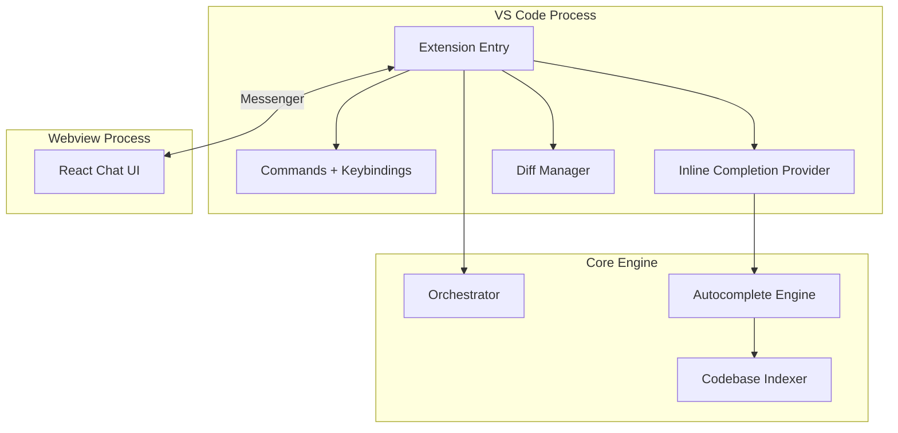

# Fase 4: IDE Extension (VS Code / Cursor)

**Semanas**: 12-15
**Objetivo**: Extensao completa para VS Code e Cursor com inline suggestions e chat.
**Pre-requisitos**: Fase 2 concluida (Core funcional). Fase 3 e independente (pode rodar em paralelo).
**Entregavel**: Extensao publicavel no VS Code Marketplace.

---

## 1. Visao Geral

A extensao IDE e a interface mais complexa por integrar:
1. **Chat lateral** — Webview React embutida
2. **Inline suggestions** — Tab completion com FIM (Fill-in-the-Middle)
3. **Diff viewing** — Aceitar/rejeitar mudancas inline
4. **Codebase indexing** — LanceDB + FTS5 para busca semantica

### Arquitetura da Extensao



---

## 2. Tasks Detalhadas

### 2.1 Extension Scaffold (Complexidade: Media)

**Path**: `packages/vscode/`
**Estimativa**: 2-3 dias

**Configuracao do package.json da extensao**:
```json
{
  "name": "athion-assistent",
  "displayName": "Athion Assistent",
  "description": "AI coding assistant with orchestrator + subagents",
  "version": "0.0.1",
  "engines": { "vscode": "^1.85.0" },
  "categories": ["AI", "Programming Languages"],
  "activationEvents": ["onStartupFinished"],
  "main": "./dist/extension.js",
  "contributes": {
    "viewsContainers": {
      "activitybar": [{
        "id": "athion",
        "title": "Athion Assistent",
        "icon": "resources/icon.svg"
      }]
    },
    "views": {
      "athion": [{
        "type": "webview",
        "id": "athion.chat",
        "name": "Chat"
      }]
    },
    "commands": [
      { "command": "athion.newChat", "title": "Athion: New Chat" },
      { "command": "athion.explainCode", "title": "Athion: Explain Selection" },
      { "command": "athion.reviewCode", "title": "Athion: Review Selection" },
      { "command": "athion.refactorCode", "title": "Athion: Refactor Selection" },
      { "command": "athion.generateTests", "title": "Athion: Generate Tests" },
      { "command": "athion.toggleInline", "title": "Athion: Toggle Inline Suggestions" },
      { "command": "athion.acceptDiff", "title": "Athion: Accept Change" },
      { "command": "athion.rejectDiff", "title": "Athion: Reject Change" }
    ],
    "keybindings": [
      { "command": "athion.newChat", "key": "ctrl+shift+a", "mac": "cmd+shift+a" },
      { "command": "athion.explainCode", "key": "ctrl+shift+e", "mac": "cmd+shift+e" },
      { "command": "athion.toggleInline", "key": "ctrl+shift+i", "mac": "cmd+shift+i" }
    ]
  }
}
```

---

### 2.2 Messenger Bridge (Complexidade: Alta)

**Origem**: Continue (extensions/vscode/ messenger pattern)
**Estimativa**: 3-4 dias

**Responsabilidade**: Comunicacao bidirecional entre Extension (Node.js) e Webview (React).

```typescript
// Extension side
export interface ExtensionMessenger {
  postToWebview(type: string, data: unknown): void
  onFromWebview(type: string, handler: (data: unknown) => void): void
}

// Webview side
export interface WebviewMessenger {
  postToExtension(type: string, data: unknown): void
  onFromExtension(type: string, handler: (data: unknown) => void): void
}
```

**Mensagens tipadas**:
```typescript
type WebviewMessage =
  | { type: 'chat.send'; content: string }
  | { type: 'chat.abort' }
  | { type: 'session.list' }
  | { type: 'session.select'; id: string }
  | { type: 'config.get' }
  | { type: 'permission.respond'; decision: 'allow' | 'deny' }

type ExtensionMessage =
  | { type: 'chat.stream'; event: StreamEvent }
  | { type: 'chat.complete' }
  | { type: 'session.list.result'; sessions: Session[] }
  | { type: 'config.result'; config: Config }
  | { type: 'permission.request'; action: string; target: string }
```

---

### 2.3 Inline Completion - FIM Pipeline (Complexidade: Alta)

**Origem**: Continue (autocomplete/)
**Estimativa**: 5-6 dias

**Pipeline**:
```
User digita → Debounce 150ms → Prefilter → Context Gathering →
  Build FIM Prompt → LLM FIM Call → Postprocess → Bracket Match → Ghost Text
```

**Componentes**:

1. **Debounce** — 150ms apos ultima tecla
2. **Prefilter** — Ignorar contextos onde completion nao faz sentido (comentarios, strings, etc.)
3. **Context Gathering**:
   - Prefix (texto antes do cursor)
   - Suffix (texto apos o cursor)
   - Git diffs recentes
   - Imports/symbols do arquivo
   - Snippets similares do indice
4. **FIM Prompt Building** — Formato `<fim_prefix>...<fim_suffix>...<fim_middle>`
5. **LLM Call** — Modelo rapido dedicado (ex: qwen2.5-coder:1.5b para autocomplete)
6. **Postprocess** — Limpar output, remover tokens especiais
7. **Bracket Matching** — Garantir balanceamento de brackets
8. **Ghost Text** — Mostrar como texto fantasma no editor

**VS Code API**:
```typescript
vscode.languages.registerInlineCompletionItemProvider('*', {
  async provideInlineCompletionItems(document, position, context, token) {
    const completion = await autocompleteEngine.complete({
      document,
      position,
      context,
      signal: token,
    })
    if (!completion) return []
    return [new vscode.InlineCompletionItem(completion.text, completion.range)]
  }
})
```

---

### 2.4 Chat Webview - React GUI (Complexidade: Alta)

**Estimativa**: 4-5 dias

**Componentes React** (embutidos no webview):

| Componente | Responsabilidade |
|------------|-----------------|
| `ChatPanel` | Layout principal |
| `MessageList` | Lista de mensagens com virtualizacao |
| `CodeBlock` | Blocos de codigo com syntax highlighting |
| `DiffView` | Mostrar diffs com aceitar/rejeitar |
| `ToolCallCard` | Card de tool call com status |
| `InputArea` | Input com @mentions e file references |

**Build**: React 19 compilado para um unico JS/CSS que e injetado no webview.

---

### 2.5 Diff Viewing (Complexidade: Media)

**Estimativa**: 2-3 dias

Quando o assistente sugere mudancas em um arquivo:
1. Mostra diff inline no editor (verde = adicionado, vermelho = removido)
2. Botoes Accept / Reject por bloco
3. Accept All / Reject All
4. CodeLens com acoes

---

### 2.6 Commands + Keybindings (Complexidade: Media)

**Estimativa**: 2 dias

**15+ comandos**:
- Chat: new, resume, abort, clear
- Code: explain, review, refactor, generate tests, fix bug
- Inline: toggle, accept, reject
- Navigation: focus chat, focus editor
- Config: open settings

---

### 2.7 Codebase Indexer (Complexidade: Alta)

**Origem**: Continue (indexing/)
**Estimativa**: 5-7 dias

**Componentes**:
1. **File Walker** — Percorre arquivos respeitando .gitignore + .athionignore
2. **Chunker** — Tree-sitter semantico + sliding window
3. **Vector Index** — LanceDB com embeddings (ONNX local ou API)
4. **FTS Index** — SQLite FTS5 para busca textual
5. **Snippet Index** — Simbolos via Tree-sitter queries
6. **Incremental** — So reprocessa arquivos alterados

**Dependencias**:
```bash
bun add vectordb tree-sitter tree-sitter-typescript tree-sitter-javascript tree-sitter-python
```

---

## 3. Checklist de Conclusao

- [ ] Extensao instala no VS Code e Cursor
- [ ] Chat lateral funcional com streaming
- [ ] Tab completion com ghost text (< 500ms P95)
- [ ] Diff viewing com accept/reject
- [ ] 15+ comandos com keybindings
- [ ] Codebase indexing funcional
- [ ] @mentions para arquivos e simbolos
- [ ] Context providers (selection, file, git diff)

**Proxima fase**: [Fase 5: Desktop + OS Integration](../fase-5-desktop-os-integration/fase-5-desktop-os-integration.md)
