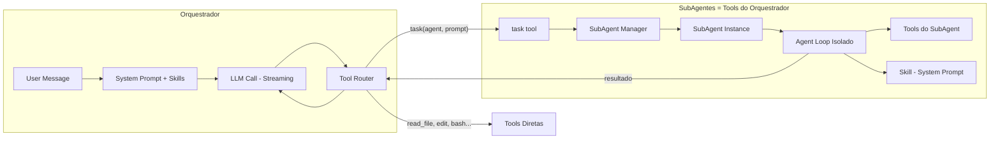
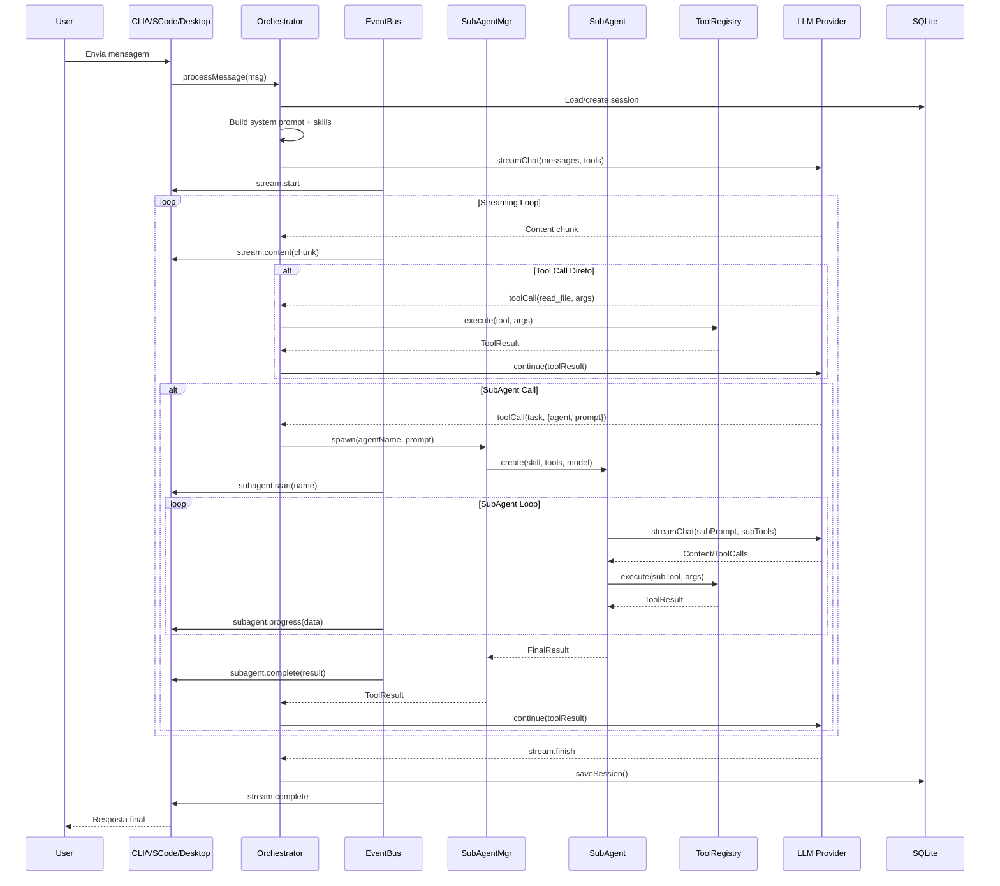
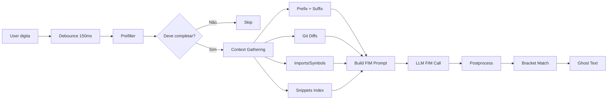
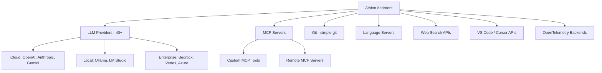
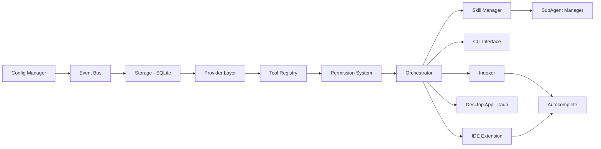

# Athion Assistent - Documento de Definição do Projeto

## 1. Visão Geral

### O que é
**Athion Assistent** é um assistente de codificação alimentado por IA com arquitetura de **orquestrador + subagentes**. O sistema opera em 3 interfaces: extensão para VS Code/Cursor (com inline suggestions e chat), CLI interativo no terminal (estilo Claude Code), e app desktop (Tauri). O orquestrador delega tarefas para subagentes especializados, onde cada subagente possui suas próprias tools e definições. Skills (prompts imutáveis) definem o comportamento dos subagentes.

### Problema que resolve
Assistentes de código atuais tratam tudo como um único agente monolítico. O Athion Assistent decompõe o trabalho em subagentes especializados (code review, test generation, refactoring, etc.), permitindo execução paralela, contextos isolados, e extensibilidade — o usuário pode criar novos subagentes sem alterar o core.

### Público-alvo
- Desenvolvedores individuais que querem um assistente de código poderoso
- Times que precisam de agentes customizados para workflows específicos
- Empresas que querem padronizar práticas via skills corporativas

### Interfaces
1. **Extensão VS Code/Cursor** — Inline suggestions (tab completion) + chat lateral
2. **CLI Terminal** — Chat interativo estilo Claude Code
3. **App Desktop (Tauri)** — Aplicação desktop nativa para uso sem IDE

---

## 2. Projetos de Referência Analisados

### 2.1 Continue (Score Geral: 6.5/10)

**O que faz bem:**
- **70+ provedores LLM** com abstração elegante (BaseLLM template method)
- **Terminal Security** excepcional (1.242 linhas de análise de shell)
- **Sistema de Context Providers** (30+ tipos) — qualquer fonte vira @mention
- **Indexação multi-modal** — LanceDB (vetorial) + SQLite FTS5 + Code Snippets
- **Autocomplete/Inline Suggestion** — Pipeline completo com FIM, debounce, bracket matching
- **MCP Integration** completa com tools, resources, slash commands

**O que faz mal:**
- **God Classes** — Core 1.516 linhas, DocsService 1.298 linhas
- **Sem DI Container** — 10+ singletons impossíveis de mockar
- **Frontend sem code splitting** nem virtual scrolling (500KB+ bundle)
- **SOLID 5/10** — Violações SRP/OCP/DIP críticas
- **SQLite single-writer** como bottleneck

### 2.2 OpenCode (Score Geral: 7.8/10)

**O que faz bem:**
- **Context-based DI** — Isolamento por projeto, superior a singletons
- **Event Bus tipado** com Zod schemas (9.5/10)
- **Tool.define()** — Interface declarativa elegante para tools
- **Permission System v2** — Rule-based com allow/ask/deny granular
- **SQLite WAL** otimizado com Drizzle ORM (pragmas tuned)
- **Segurança Shell** — Tree-sitter AST parsing para comandos destrutivos
- **SolidJS frontend** — Performance sem Virtual DOM, 55 componentes UI
- **16 temas OKLCH** + 16 idiomas (i18n completo)
- **Hierarquia de config 7 níveis** — Remote → Global → Project → Inline → Managed

**O que faz mal:**
- **Observabilidade 2/10** no frontend — Sem Sentry, PostHog, ou structured logging
- **0 testes UI** nos 55 componentes
- **God Classes** residuais — message-part.tsx 2.115 linhas, session/prompt.ts 1.961
- **48 contextos** causa nesting profundo
- **Sem Circuit Breaker** para provedores com falha

### 2.3 Qwen Code (Score Geral: 6.5/10)

**O que faz bem:**
- **CoreToolScheduler** — State machine robusta (validating → scheduled → executing → success)
- **Sistema de Subagentes** — SubagentManager com 5 níveis de precedência
- **Skills em SKILL.md** — Prompts reutilizáveis com schema padronizado
- **OAuth Device Code + PKCE** — Auth sem API key via QR code
- **ContentGenerator** factory — Multi-provider limpo (Gemini, OpenAI, Anthropic)
- **Telemetria OpenTelemetry** completa (gRPC + HTTP)
- **Non-Interactive JSON mode** — Integração com IDEs e CI/CD
- **25 componentes especializados** para tool calls

**O que faz mal:**
- **AppContainer 1.665 linhas** — God Component (SRP 3/10)
- **useGeminiStream 1.459 linhas** — God Hook
- **0 testes WebUI** nos 81 componentes
- **Sem banco de dados** — Apenas JSONL filesystem
- **21 contextos dispersos** no CLI

---

## 3. Matriz de Comparação

### 3.1 Comparação por Domínio

| Domínio | Continue | OpenCode | Qwen Code | Vencedor | Justificativa |
|---------|----------|----------|-----------|----------|---------------|
| **DI/IoC Pattern** | 4/10 Singletons | **9/10** Context-based | 5/10 Basic | **OpenCode** | Isolamento por projeto, testável, sem singletons |
| **Tool System** | 6/10 callTool router | **9/10** Tool.define() | 8/10 DeclarativeTool | **OpenCode** | Interface declarativa com Zod, metadata, permission built-in |
| **LLM Providers** | **9/10** 70+ providers | 8/10 40+ via AI SDK | 7/10 5 providers | **Continue** | Mais providers, BaseLLM template elegante |
| **Event System** | 5/10 EventEmitter | **9.5/10** Bus tipado | 6/10 Callbacks | **OpenCode** | Zod-validated, centralizado, desacoplado |
| **Permission** | 5/10 Policy simples | **8.5/10** Rule-based v2 | 7/10 ApprovalMode | **OpenCode** | Granular allow/ask/deny por arquivo/diretório |
| **Shell Security** | **8/10** terminal-security | 8.5/10 AST parsing | 6/10 Básico | **OpenCode** | Tree-sitter AST + classificação safe/blocked |
| **Subagentes** | 3/10 Não tem | 6/10 Agent simples | **9/10** SubagentManager | **Qwen Code** | 5 níveis precedência, events, timeout, stats |
| **Skills** | 4/10 .prompt files | 7/10 SKILL.md | **8/10** skill-manager | **Qwen Code** | Schema padronizado, 3 fontes discovery, tools whitelist |
| **Config Hierarchy** | 5/10 3 níveis | **9/10** 7 níveis | 7/10 4 níveis | **OpenCode** | Remote → Global → Project → Inline → Managed |
| **Autocomplete** | **9/10** Pipeline FIM | 5/10 Não tem | 4/10 Básico | **Continue** | Debounce, context gathering, bracket fix, ghost text |
| **Indexação** | **9/10** Multi-modal | 4/10 Básica | 5/10 File discovery | **Continue** | LanceDB + FTS5 + Code Snippets + Tree-sitter |
| **Context Providers** | **9/10** 30+ tipos | 5/10 Básico | 5/10 Básico | **Continue** | @mention qualquer fonte, reranking, multi-index |
| **Storage** | 6/10 SQLite basic | **9/10** SQLite WAL+Drizzle | 5/10 JSONL files | **OpenCode** | WAL mode, pragmas tuned, migrations, schema tipado |
| **Telemetria** | 7/10 PostHog+Sentry | 2/10 Logging básico | **9/10** OpenTelemetry | **Qwen Code** | OTLP gRPC+HTTP, distributed tracing completo |
| **Streaming** | **8/10** AsyncGenerator | 7/10 AI SDK stream | 8/10 AsyncGenerator | **Continue** | Ubíquo, protocol tipado, streaming-first |
| **MCP** | **8/10** Tools+Resources | 7/10 4 transports | 7/10 Client completo | **Continue** | Resources, Tools, Slash Commands via MCP |
| **Frontend CLI** | 7/10 Ink+Commander | 8/10 SolidJS+yargs | 6/10 Ink+yargs | **OpenCode** | SolidJS sem Virtual DOM, @opentui 60fps |
| **Frontend IDE** | **8/10** VSCode+IntelliJ | 6/10 Tauri desktop | 5/10 VSCode basic | **Continue** | Messenger bridge, 30+ commands, webview React |
| **Temas/i18n** | 3/10 Via IDE host | **9/10** 16+16 | 7/10 15+10 | **OpenCode** | OKLCH procedural, 16 idiomas completos |
| **Testes** | 6/10 ~15% cov | 5/10 ~10% cov | 6/10 ~34% CLI | **Qwen Code** | Maior cobertura CLI, Storybook 29 stories |
| **Error Handling** | 6/10 Try/catch | **8/10** NamedError+Result | 6/10 Custom errors | **OpenCode** | Discriminated unions inspirado em Rust |

### 3.2 Resumo de Vencedores

| Vencedor | Domínios |
|----------|----------|
| **OpenCode** (11) | DI, Tools, Event Bus, Permission, Security, Config, Storage, CLI, Temas/i18n, Error Handling, Shell Security |
| **Continue** (6) | LLM Providers, Autocomplete, Indexação, Context Providers, Streaming, IDE Extension, MCP |
| **Qwen Code** (3) | Subagentes, Skills, Telemetria, Testes |

---

## 4. Stack Tecnológica

### 4.1 Decisões de Stack

| Camada | Tecnologia | Origem | Justificativa |
|--------|-----------|--------|---------------|
| **Runtime** | Bun 1.x | OpenCode | Performance 3-5x Node.js, JSX nativo, bundler integrado |
| **Linguagem** | TypeScript 5.8+ strict | Todos | Type safety, compatibilidade ecossistema |
| **Build** | Turborepo + Bun | OpenCode | Monorepo orchestration + fast builds |
| **HTTP Server** | Hono 4.x | OpenCode | Ultra-leve (14KB), middleware-based, multi-runtime |
| **Validação** | Zod 4.x | OpenCode | Type inference, composable, runtime validation |
| **Database** | SQLite WAL + Drizzle ORM | OpenCode | Single-user otimizado, migrations tipadas |
| **LLM Framework** | Vercel AI SDK 5.x | OpenCode | 40+ providers, streaming nativo, tool calling |
| **LLM Fallback** | Adapters diretos | Continue | Para providers não suportados pelo AI SDK |
| **MCP** | @modelcontextprotocol/sdk | Continue | Protocol completo: tools, resources, prompts |
| **Event Bus** | Custom tipado (Zod) | OpenCode | Pub/sub desacoplado, type-safe |
| **CLI Framework** | yargs 18.x | OpenCode | Mais flexível que Commander para subcommands |
| **CLI UI** | Ink 6 (React) | Qwen Code | Mais maduro que @opentui, maior ecossistema |
| **IDE Extension** | VS Code Extension API | Continue | Messenger bridge + webview pattern |
| **GUI Desktop** | Tauri 2.x + React 19 + Tailwind 4 | OpenCode (Tauri) + Novo | App nativo leve (~10MB), frontend React, backend Rust seguro |
| **Indexação** | LanceDB + SQLite FTS5 | Continue | Multi-modal: vetorial + full-text |
| **Code Parsing** | Tree-sitter (WASM) | Continue+OpenCode | AST parsing para segurança e indexação |
| **Telemetria** | OpenTelemetry | Qwen Code | Padrão da indústria, multi-backend |
| **Testes** | Vitest + Playwright | Novo | Fast unit tests + E2E cross-platform |
| **Logging** | Pino (structured) | Novo | JSON structured, melhor que winston para prod |

### 4.2 ADR-001: Runtime — Bun vs Node.js

**Contexto**: Precisamos de um runtime performante para CLI e servidor.

**Decisão**: **Bun 1.x** como runtime principal, com fallback Node.js para CI.

**Alternativas descartadas**:
- Node.js — 3-5x mais lento em startup, require bundler separado
- Deno — Ecossistema npm incompleto, toolchain menos madura

**Consequências**:
- (+) Startup 3-5x mais rápido, bundler integrado, test runner built-in
- (+) SQLite driver nativo (bun:sqlite) — mais rápido que better-sqlite3
- (-) Alguns pacotes npm podem ter incompatibilidades
- (-) Menor base instalada que Node.js

### 4.3 ADR-002: Vercel AI SDK vs SDKs Diretos

**Contexto**: Precisamos suportar múltiplos provedores LLM.

**Decisão**: **Vercel AI SDK** como primary, com adapters diretos para providers não suportados.

**Alternativas descartadas**:
- SDKs diretos (Continue approach) — Requer manter 70+ adaptadores manualmente
- LangChain — Overhead desnecessário, abstração demais

**Consequências**:
- (+) 40+ providers out-of-box, streaming unificado, tool calling padronizado
- (+) Comunidade ativa, updates frequentes
- (-) Dependência de terceiro para camada crítica
- (-) Providers muito novos podem não ter adapter

### 4.4 ADR-003: Ink (React) vs @opentui (SolidJS) para CLI

**Contexto**: Precisamos de framework para terminal UI interativo.

**Decisão**: **Ink 6 (React)** para CLI terminal.

**Alternativas descartadas**:
- @opentui/solid — Menos maduro, menor ecossistema, docs escassos
- Blessed/blessed-contrib — Abandonado
- Raw ANSI — Complexidade desnecessária

**Consequências**:
- (+) Ecossistema React maduro, hooks reutilizáveis, Ink bem documentado
- (+) Compartilha modelo mental com GUI desktop (ambos React)
- (-) Virtual DOM overhead (mitigado por Ink otimizar terminal rendering)
- (-) Bundle maior que SolidJS (~45KB vs ~7KB, irrelevante para CLI)

---

## 5. Arquitetura

### 5.1 Diagrama de Alto Nível

```mermaid
graph TB
    subgraph Interfaces["Interfaces de Usuário"]
        VSCode[VS Code / Cursor Extension]
        CLI[CLI Terminal - Ink/React]
        Desktop[App Desktop - Tauri/React]
    end

    subgraph Core["Core Engine"]
        Orchestrator[Orquestrador Principal]
        SubagentMgr[SubAgent Manager]
        SkillMgr[Skill Manager]
        ConfigMgr[Config Manager]
        EventBus[Event Bus - Zod Typed]
    end

    subgraph Subagents["SubAgentes"]
        SA1[Code Review Agent]
        SA2[Test Generation Agent]
        SA3[Refactoring Agent]
        SA4[Documentation Agent]
        SA5[Custom Agents...]
    end

    subgraph Infrastructure["Infraestrutura"]
        ProviderLayer[Provider Layer - AI SDK]
        ToolRegistry[Tool Registry]
        PermissionSys[Permission System]
        Storage[(SQLite WAL + Drizzle)]
        Indexer[Codebase Indexer]
        MCP[MCP Client]
        Telemetry[OpenTelemetry]
    end

    subgraph OSLayer["OS Integration - Tauri"]
        Tray[System Tray + Quick Chat]
        Hotkeys[Global Hotkeys]
        CtxMenu[Native Context Menus]
        Clipboard[Clipboard Watch]
        Notifications[Native Notifications]
        DeepLinks[Deep Links - athion://]
    end

    subgraph LLMs["Provedores LLM"]
        OpenAI[OpenAI]
        Anthropic[Anthropic]
        Google[Google Gemini]
        Ollama[Ollama Local]
        More[+36 Providers]
    end

    VSCode --> Orchestrator
    CLI --> Orchestrator
    Desktop --> Orchestrator

    Orchestrator --> SubagentMgr
    Orchestrator --> SkillMgr
    Orchestrator --> ConfigMgr
    Orchestrator --> EventBus

    SubagentMgr --> SA1
    SubagentMgr --> SA2
    SubagentMgr --> SA3
    SubagentMgr --> SA4
    SubagentMgr --> SA5

    SA1 --> ToolRegistry
    SA2 --> ToolRegistry
    SA3 --> ToolRegistry
    SA4 --> ToolRegistry

    Orchestrator --> ProviderLayer
    Orchestrator --> ToolRegistry
    ToolRegistry --> PermissionSys
    ToolRegistry --> MCP

    ProviderLayer --> OpenAI
    ProviderLayer --> Anthropic
    ProviderLayer --> Google
    ProviderLayer --> Ollama
    ProviderLayer --> More

    Orchestrator --> Storage
    Orchestrator --> Indexer
    Orchestrator --> Telemetry

    Desktop --> Tray
    Desktop --> Hotkeys
    Desktop --> CtxMenu
    Desktop --> Clipboard
    Desktop --> Notifications
    Desktop --> DeepLinks
```



### 5.2 Arquitetura do Orquestrador + SubAgentes



### 5.3 Fluxo de Dados Principal



### 5.4 Fluxo de Inline Suggestions (IDE)



### 5.5 Integrações Externas



---

## 6. Módulos Detalhados

### 6.1 Orchestrator (Core)

**Origem**: Novo design, inspirado em Continue (Core class) + Qwen Code (GeminiClient)

**Responsabilidade**: Orquestrar o ciclo de chat, despachar tool calls para subagentes ou tools diretas, gerenciar sessões e streaming.

**Interface Pública**:
```typescript
interface Orchestrator {
  chat(sessionId: string, message: UserMessage): AsyncGenerator<StreamEvent>
  createSession(projectId: string): Session
  loadSession(sessionId: string): Session
  getAvailableTools(): ToolDefinition[]
  getAvailableAgents(): AgentDefinition[]
}
```

**Dependências**: EventBus, SubAgentManager, SkillManager, ProviderLayer, ToolRegistry, Storage

**Nível de reuso**: **Reescrever** — Nenhum projeto tem orquestrador limpo o suficiente. Continue (Core 1.516 linhas) e Qwen Code (client.ts 21K linhas) são God Classes.

**Princípio**: O orquestrador NUNCA deve ser God Class. Máximo 300 linhas. Delega para serviços especializados.

### 6.2 SubAgent Manager

**Origem**: Qwen Code (subagent-manager.ts)

**Responsabilidade**: Criar, executar e monitorar subagentes. Cada subagente é uma instância isolada com seu próprio ciclo de chat, tools e skill.

**Interface Pública**:
```typescript
interface SubAgentManager {
  spawn(config: SubAgentConfig, prompt: string, signal: AbortSignal): AsyncGenerator<SubAgentEvent>
  list(): SubAgentInfo[]
  getAgent(name: string): SubAgentConfig | undefined
  registerAgent(config: SubAgentConfig): void
}

interface SubAgentConfig {
  name: string
  description: string
  skill: string                    // Nome da skill (system prompt imutável)
  tools: string[]                  // Whitelist de tools permitidas
  model?: ModelConfig              // Override de modelo
  maxTurns?: number                // Limite de turns (default: 50)
  level: 'builtin' | 'user' | 'project' | 'session'
}
```

**Nível de reuso**: **Adaptar** do Qwen Code — Manter 5 níveis de precedência, eventos de tracking, mas refatorar para usar EventBus do OpenCode e ToolRegistry unificado.

### 6.3 Skill Manager

**Origem**: Qwen Code (skill-manager.ts) + OpenCode (skill.ts)

**Responsabilidade**: Descobrir, carregar e validar skills. Skills são system prompts em Markdown com frontmatter YAML — **imutáveis em runtime**.

**Interface Pública**:
```typescript
interface SkillManager {
  loadSkill(name: string): Skill
  listSkills(): SkillInfo[]
  discoverSkills(): void          // Re-scan diretórios
  validateSkill(content: string): ValidationResult
}

interface Skill {
  name: string
  description: string
  tools?: string[]                // Whitelist de tools (opcional)
  systemPrompt: string            // Conteúdo Markdown processado
  level: 'builtin' | 'user' | 'project'
}
```

**Formato SKILL.md**:
```markdown
---
name: "code-reviewer"
description: "Revisa código com foco em qualidade, segurança e boas práticas"
tools: [read_file, grep_search, glob]
---

Você é um revisor de código senior especializado em...

## Regras
- Sempre verificar vulnerabilidades OWASP Top 10
- Sugerir melhorias incrementais, não reescritas completas
...
```

**Diretórios de descoberta** (por precedência):
1. `builtin` — `src/skills/` (read-only, shipped com o app)
2. `user` — `~/.athion/skills/<name>/SKILL.md`
3. `project` — `.athion/skills/<name>/SKILL.md`

**Nível de reuso**: **Adaptar** — Combinar formato SKILL.md do Qwen Code com sistema de discovery multi-level do OpenCode.

### 6.4 Tool Registry

**Origem**: OpenCode (Tool.define() + registry.ts)

**Responsabilidade**: Registrar, descobrir e executar tools. Cada tool é declarativa com schema Zod.

**Interface Pública**:
```typescript
// Definição de Tool (inspirado OpenCode)
const ReadFile = Tool.define("read_file", async ({ agent }) => ({
  description: "Lê o conteúdo de um arquivo",
  parameters: z.object({
    path: z.string().describe("Caminho do arquivo"),
    offset: z.number().optional().describe("Linha inicial"),
    limit: z.number().optional().describe("Número de linhas"),
  }),
  async execute(args, ctx) {
    await ctx.checkPermission("read", args.path)
    const content = await fs.readFile(args.path, 'utf-8')
    return { title: `Read ${args.path}`, output: content }
  }
}))

// Registry
interface ToolRegistry {
  register(tool: ToolDefinition): void
  get(name: string): ToolDefinition | undefined
  list(filter?: ToolFilter): ToolDefinition[]
  execute(name: string, args: unknown, ctx: ExecutionContext): Promise<ToolResult>
}
```

**Tools built-in** (Fase 1):
| Tool | Categoria | Origem |
|------|-----------|--------|
| `read_file` | Read | OpenCode |
| `write_file` | Write | OpenCode |
| `edit_file` | Write | OpenCode |
| `glob` | Search | OpenCode |
| `grep_search` | Search | OpenCode |
| `bash` | Execute | OpenCode |
| `list_directory` | Read | OpenCode |
| `web_search` | Fetch | OpenCode |
| `web_fetch` | Fetch | OpenCode |
| `task` | Agent | Qwen Code |
| `todo_write` | State | Qwen Code |
| `skill` | Agent | Qwen Code |
| `mcp_tool` | MCP | Continue |

**Nível de reuso**: **Adaptar** do OpenCode — Tool.define() é a melhor interface. Adicionar tools do Continue (web_fetch, mcp_tool) e Qwen Code (task, skill).

### 6.5 Event Bus

**Origem**: OpenCode (bus/index.ts)

**Responsabilidade**: Comunicação desacoplada entre módulos via pub/sub tipado.

**Interface Pública**:
```typescript
// Definir evento
const StreamContent = BusEvent.define("stream.content", z.object({
  sessionId: z.string(),
  content: z.string(),
  index: z.number(),
}))

// Publicar
Bus.publish(StreamContent, { sessionId: "abc", content: "Hello", index: 0 })

// Subscrever
const unsub = Bus.subscribe(StreamContent, (event) => {
  renderContent(event.properties.content)
})
```

**Eventos do sistema**:
| Evento | Quando |
|--------|--------|
| `stream.start` | Início de streaming |
| `stream.content` | Chunk de conteúdo |
| `stream.tool_call` | Tool call detectado |
| `stream.tool_result` | Resultado de tool |
| `stream.complete` | Fim de streaming |
| `subagent.start` | SubAgent spawned |
| `subagent.progress` | SubAgent update |
| `subagent.complete` | SubAgent finalizado |
| `session.created` | Nova sessão |
| `session.updated` | Sessão atualizada |
| `config.changed` | Config alterado |
| `permission.request` | Permissão solicitada |

**Nível de reuso**: **Copiar** do OpenCode — Implementação excelente (9.5/10), apenas ajustar naming.

### 6.6 Provider Layer

**Origem**: OpenCode (Vercel AI SDK) + Continue (adapters para providers extras)

**Responsabilidade**: Abstração unificada para múltiplos provedores LLM.

**Interface Pública**:
```typescript
interface ProviderLayer {
  getProvider(id: string): AIProvider
  listProviders(): ProviderInfo[]
  listModels(providerId?: string): ModelInfo[]
  streamChat(config: ChatConfig): AsyncGenerator<StreamEvent>
  generateObject<T>(config: ObjectConfig<T>): Promise<T>
}
```

**Nível de reuso**: **Adaptar** — Usar Vercel AI SDK como base (OpenCode), com adapters customizados para providers não suportados (Continue pattern).

### 6.7 Permission System

**Origem**: OpenCode (permission/next.ts)

**Responsabilidade**: Controle de acesso granular para execução de tools.

**Interface Pública**:
```typescript
interface PermissionSystem {
  check(action: string, target: string): 'allow' | 'ask' | 'deny'
  grant(rule: PermissionRule): void
  revoke(ruleId: string): void
  getRules(): PermissionRule[]
}

type PermissionRule = {
  action: string        // "bash", "edit", "read", "*"
  target?: string       // "/path/**", "*"
  decision: 'allow' | 'ask' | 'deny'
  scope: 'once' | 'session' | 'remember'
}
```

**Nível de reuso**: **Adaptar** do OpenCode — Manter rule-based approach, adicionar Tree-sitter AST validation para shell commands.

### 6.8 Storage

**Origem**: OpenCode (storage/db.ts + Drizzle ORM)

**Responsabilidade**: Persistência de sessões, mensagens, permissões.

**Schema**:
```typescript
// Sessions
const sessions = sqliteTable('sessions', {
  id: text('id').primaryKey(),
  projectId: text('project_id').notNull(),
  title: text('title'),
  createdAt: integer('created_at').notNull(),
  updatedAt: integer('updated_at').notNull(),
  metadata: text('metadata', { mode: 'json' }),
})

// Messages
const messages = sqliteTable('messages', {
  id: text('id').primaryKey(),
  sessionId: text('session_id').references(() => sessions.id),
  role: text('role').notNull(),  // 'user' | 'assistant' | 'system'
  parts: text('parts', { mode: 'json' }).notNull(),
  createdAt: integer('created_at').notNull(),
})

// Permissions
const permissions = sqliteTable('permissions', {
  id: text('id').primaryKey(),
  action: text('action').notNull(),
  target: text('target'),
  decision: text('decision').notNull(),
  scope: text('scope').notNull(),
})
```

**Pragmas**: WAL mode, 64MB cache, 5s busy_timeout, foreign keys ON

**Nível de reuso**: **Copiar** schema do OpenCode, adaptar para Bun SQLite driver nativo.

### 6.9 Config Manager

**Origem**: OpenCode (config/config.ts)

**Responsabilidade**: Hierarquia de configuração com merge por precedência.

**Hierarquia** (5 níveis para o Athion):
1. **Defaults** — Built-in no código
2. **Global** — `~/.athion/config.json`
3. **Project** — `.athion/config.json` ou `athion.json`
4. **Environment** — `ATHION_*` variáveis
5. **CLI args** — `--model`, `--provider`, etc.

**Nível de reuso**: **Adaptar** do OpenCode — Simplificar de 7 para 5 níveis (remover managed e inline).

### 6.10 Codebase Indexer

**Origem**: Continue (indexing/)

**Responsabilidade**: Indexação multi-modal do codebase para busca semântica e autocomplete.

**Componentes**:
- **File Walker** — Percorre arquivos respeitando .gitignore + .athionignore
- **Chunker** — Tree-sitter semântico + sliding window
- **Vector Index** — LanceDB com embeddings (ONNX local ou API)
- **FTS Index** — SQLite FTS5 para busca textual
- **Snippet Index** — Símbolos via Tree-sitter queries
- **Incremental Refresh** — Só processa alterações (diff-based)

**Nível de reuso**: **Adaptar** do Continue — A única indexação multi-modal completa. Refatorar DocsService (God Class 1.298 linhas) em serviços menores.

### 6.11 Autocomplete Engine

**Origem**: Continue (autocomplete/)

**Responsabilidade**: Tab completion com IA (Fill-in-the-Middle) para extensão IDE.

**Pipeline**:
```
Debounce → Prefilter → Context Gathering → Prompt Building
    → LLM FIM Call → Postprocessing → Bracket Matching → Ghost Text
```

**Nível de reuso**: **Adaptar** do Continue — Pipeline bem estruturada, mas precisa decompor em serviços menores.

### 6.12 IDE Extension (VS Code / Cursor)

**Origem**: Continue (extensions/vscode/)

**Responsabilidade**: Integração com VS Code e Cursor via Extension API.

**Componentes**:
- **Extension Entry** — Ativação, lifecycle management
- **VsCodeIde** — Adapter para IDE APIs
- **Messenger** — Bridge bidirecional Core ↔ Webview
- **CompletionProvider** — Inline suggestions (ghost text)
- **WebviewProvider** — React GUI embutida
- **DiffManager** — Visualização e aceite de diffs
- **Commands** — 30+ keybindings registrados

**Nível de reuso**: **Adaptar** do Continue — Pattern Messenger + Webview é o mais maduro.

### 6.13 CLI Interface

**Origem**: Mix — yargs (OpenCode) + Ink (Qwen Code) + ServiceContainer (Continue)

**Responsabilidade**: Interface terminal interativa com chat, ferramentas e configuração.

**Componentes**:
- **CLI Entry** — yargs com subcomandos (chat, serve, config, agents)
- **TUI Chat** — Ink/React com streaming, tool calls, markdown rendering
- **Service Container** — DI para serviços (Config, Auth, Model, History)

**Anti-patterns a evitar**:
- AppContainer 1.665 linhas (Qwen Code) — Máximo 200 linhas
- useGeminiStream 1.459 linhas (Qwen Code) — Máximo 150 linhas por hook
- 21 contextos (Qwen Code) — Máximo 5-7 contextos focados

**Nível de reuso**: **Reescrever** — Nenhum projeto tem CLI sem God Components.

### 6.14 Telemetria

**Origem**: Qwen Code (telemetry/)

**Responsabilidade**: Observabilidade com OpenTelemetry.

**Stack**:
- OpenTelemetry SDK para spans e traces
- Exporters: OTLP gRPC + HTTP
- Métricas: latência LLM, tool execution time, tokens usados, erros
- Opt-in com dados anonimizados

**Nível de reuso**: **Adaptar** do Qwen Code — Única implementação OpenTelemetry completa.

### 6.15 Token Manager & Compaction Engine

**Origem**: Híbrido — Qwen Code (threshold + XML summary + loop detection) + OpenCode (truncamento + prune + hooks) + Continue (multi-tokenizer + autocomplete budget + 3 pontos de compaction)

**Responsabilidade**: Controle de tokens e compactação de contexto, otimizado para modelos locais com context windows pequenos (4K-32K).

**Interface Pública**:
```typescript
interface TokenManager {
  // Budget
  calculateBudget(contextLength: number): TokenBudget
  allocateAutocompleteBudget(ctx: AutocompleteContext): AutocompleteBudget

  // Compaction
  checkCompaction(point: CompactionPoint, messages: Message[]): Promise<Message[]>
  runCompactionPipeline(messages: Message[], budget: TokenBudget): Promise<Message[]>

  // Token counting
  countTokens(text: string, model: string): number
  getTokenizer(model: string): Tokenizer

  // Loop detection
  checkLoop(messages: Message[]): LoopResult

  // Hooks
  onCompacting: Hook<CompactionEvent, Message[]>
}

interface TokenBudget {
  total: number           // Context window total
  system: number          // System prompt + skill + tool defs
  history: number         // Histórico compressível
  currentTurn: number     // Turno atual
  outputReserve: number   // Reserva para output (35%)
  safety: number          // Buffer de segurança
}

enum CompactionPoint {
  PRE_API = 'pre_api',
  POST_TOOL = 'post_tool',
  PERIODIC = 'periodic',
}
```

**Pipeline de Compaction (5 estágios progressivos)**:
1. **Truncar Tool Outputs** — Limita a 500 linhas / 20KB, salva completo em arquivo (OpenCode)
2. **Prune Tool Results Antigos** — Marca outputs antigos como "[compactado]" (OpenCode)
3. **Sumarizar Histórico XML** — `<state_snapshot>` com goal, knowledge, files, actions (Qwen Code)
4. **Drop Mensagens Antigas** — FIFO preservando últimos 30% (Qwen Code)
5. **Emergency Truncation** — Mantém apenas system + última mensagem user

**Configuração**:
- Threshold: 65% (mais agressivo que Qwen Code 70%, essencial para context pequeno)
- Preservação: últimos 30% do histórico
- Output reserve: 35% do context
- Floor mínimo input: 50% do context
- Loop detection: tool repeat (3x), content chant (5x), LLM check (15 turns)
- Multi-tokenizer: tiktoken (GPT/Claude), llama tokenizer (modelos locais), fallback 4 chars/token

**Análise detalhada**: Ver [compaction-analysis.md](compaction-analysis.md)

**Nível de reuso**: **Novo** — Sistema híbrido combinando as melhores técnicas dos 3 projetos, com pipeline progressivo de 5 estágios e Token Budget Allocator exclusivos.

### 6.16 OS Integration (Desktop App)

**Origem**: Novo — funcionalidades nativas via Tauri 2.x APIs + plugins

**Responsabilidade**: Integração profunda com o sistema operacional para que o Athion Assistent se comporte como um app nativo de primeira classe, não apenas uma janela de chat.

**Componentes**:

#### System Tray & Quick Access
- **Tray Icon** — Ícone persistente na bandeja do sistema com menu de contexto
- **Quick Chat** — Popup flutuante via atalho global (ex: `Cmd+Shift+A` / `Ctrl+Shift+A`) para perguntas rápidas sem abrir a janela principal
- **Status Indicator** — Indicador visual de estado: idle, processando, erro, subagente ativo

#### Global Hotkeys
- `Cmd/Ctrl+Shift+A` — Abrir quick chat (overlay)
- `Cmd/Ctrl+Shift+V` — Enviar clipboard como contexto para o chat
- `Cmd/Ctrl+Shift+E` — Explicar texto selecionado em qualquer app
- Customizáveis via config

#### Native Context Menu (OS-level)
- **Right-click em arquivo** (Finder/Explorer/Nautilus) → "Abrir com Athion" / "Revisar com Athion" / "Explicar com Athion"
- **Right-click em pasta** → "Abrir projeto no Athion"
- Registrado via file associations e shell extensions do Tauri

#### Clipboard Integration
- **Watch mode** — Monitora clipboard e sugere ações para código copiado (opt-in)
- **Smart paste** — Colar código de qualquer app diretamente no chat com syntax highlighting
- **Copy result** — Copiar resultado do assistente com um clique, formatado para o destino

#### Filesystem & Shell Integration
- **PATH registration** — `athion` disponível no terminal após instalação (`athion chat`, `athion review file.ts`)
- **File associations** — `.athion` (project config), `.skill.md` (skills) abrem no app
- **Drag & Drop** — Arrastar arquivos/pastas para a janela do app como contexto
- **File watchers** — Monitorar mudanças no projeto aberto (hot reload de context)

#### Notifications
- **Notificações nativas** do OS para:
  - SubAgent concluiu tarefa longa
  - Permissão necessária para tool execution
  - Erro em execução de tool
  - Atualização disponível
- Respeitam configurações de "Não Perturbe" do OS

#### Window Management
- **Always on top** — Modo "pin" para manter sobre outras janelas
- **Split screen** — Suporte nativo a snap/tile do OS (macOS Stage Manager, Windows Snap)
- **Mini mode** — Janela compacta para quick chat, redimensionável
- **Multi-window** — Múltiplas sessões em janelas independentes

#### Auto-Start & Session Restore
- **Launch on login** — Opção para iniciar com o sistema (minimizado na tray)
- **Session restore** — Restaurar última sessão aberta ao reabrir o app
- **Project auto-detect** — Detectar projeto Git no diretório atual ao abrir via terminal

#### Deep Links & URL Schemes
- `athion://chat?prompt=...` — Abrir chat com prompt pré-preenchido
- `athion://review?path=...` — Abrir review de arquivo
- `athion://agent?name=...&prompt=...` — Invocar subagente específico
- Permite integração com Alfred/Raycast/Spotlight, scripts e automações

**Interface Pública**:
```typescript
interface OSIntegration {
  // System Tray
  setupTray(config: TrayConfig): void
  updateTrayStatus(status: 'idle' | 'processing' | 'error'): void
  showQuickChat(): void

  // Global Hotkeys
  registerHotkey(combo: string, action: HotkeyAction): void
  unregisterHotkey(combo: string): void

  // Notifications
  notify(notification: NativeNotification): void

  // Clipboard
  watchClipboard(enabled: boolean): void
  onClipboardChange: Hook<ClipboardEvent>

  // Deep Links
  handleDeepLink(url: string): void
  onDeepLink: Hook<DeepLinkEvent>

  // Window
  setAlwaysOnTop(enabled: boolean): void
  setMiniMode(enabled: boolean): void
  openNewWindow(sessionId?: string): void

  // Shell
  registerFileAssociations(): void
  registerPathCommand(): void
}

interface TrayConfig {
  tooltip: string
  menuItems: TrayMenuItem[]
  quickChatHotkey: string
}

interface NativeNotification {
  title: string
  body: string
  icon?: 'info' | 'success' | 'warning' | 'error'
  actions?: NotificationAction[]
  sound?: boolean
}
```

**Dependências Tauri**:
- `tauri-plugin-global-shortcut` — Global hotkeys
- `tauri-plugin-notification` — Notificações nativas
- `tauri-plugin-clipboard-manager` — Clipboard
- `tauri-plugin-deep-link` — URL schemes
- `tauri-plugin-autostart` — Auto-start
- `tauri-plugin-shell` — Shell integration
- `tauri-plugin-fs` — Filesystem nativo
- `tauri-plugin-dialog` — File dialogs nativos
- `tauri-plugin-updater` — Auto-update

**Nível de reuso**: **Novo** — Nenhum dos 3 projetos de referência tem integração OS deste nível. OpenCode usa Tauri mas apenas como wrapper web, sem explorar APIs nativas.

---

## 7. Decisões Arquiteturais (ADRs)

### ADR-004: Orquestrador + SubAgentes vs Agente Monolítico

**Contexto**: Todos os 3 projetos de referência usam agente monolítico. Precisamos de uma arquitetura que permita especialização e extensibilidade.

**Decisão**: **Orquestrador que usa subagentes como tools**.

O orquestrador recebe a mensagem do usuário e decide se executa tools diretamente ou delega para um subagente via `task` tool. Cada subagente:
- Tem seu próprio ciclo de chat isolado
- Usa uma **skill** como system prompt (imutável)
- Tem whitelist de tools permitidas
- Pode ser criado pelo usuário

**Alternativas descartadas**:
- Agente único com prompt switching — Sem isolamento, contexto poluído
- Microserviços de agentes — Over-engineering, latência de rede desnecessária

**Consequências**:
- (+) Especialização: cada agente foca em seu domínio
- (+) Extensibilidade: usuário cria novos agentes sem alterar core
- (+) Paralelismo: múltiplos subagentes podem executar simultaneamente
- (-) Complexidade: precisa gerenciar ciclo de vida dos subagentes
- (-) Overhead: cada subagente tem seu próprio contexto LLM

### ADR-005: Skills como System Prompts Imutáveis

**Contexto**: O system prompt dos subagentes precisa ser confiável e previsível.

**Decisão**: **Skills são SKILL.md files com frontmatter YAML, imutáveis em runtime**.

O usuário pode:
- Adicionar novas skills em `~/.athion/skills/` ou `.athion/skills/`
- Escolher qual skill um subagente usa
- NÃO pode alterar uma skill em runtime (precisa editar o arquivo e reiniciar)

O sistema aceita skills manuais (como claude-code e opencode fazem com CLAUDE.md e SKILL.md).

**Consequências**:
- (+) Previsibilidade: comportamento do agente é determinístico
- (+) Versionamento: skills podem ser commitados no git
- (+) Compartilhamento: skills podem ser distribuídos como packages
- (-) Requer restart para aplicar mudanças em skills

### ADR-006: Event Bus como Backbone de Comunicação

**Contexto**: Módulos precisam se comunicar (streaming, tool calls, subagent updates) sem acoplamento direto.

**Decisão**: **Event Bus centralizado com schemas Zod** (inspirado OpenCode).

**Consequências**:
- (+) Desacoplamento: módulos não importam uns aos outros
- (+) Type safety: schemas Zod previnem erros em runtime
- (+) Extensibilidade: novos eventos sem alterar módulos existentes
- (-) Debugging: fluxo indireto pode ser mais difícil de rastrear

### ADR-007: SQLite WAL vs Filesystem (JSONL)

**Contexto**: Precisamos persistir sessões, mensagens e permissões.

**Decisão**: **SQLite WAL com Drizzle ORM** (OpenCode approach).

**Alternativas descartadas**:
- JSONL files (Qwen Code) — Sem queries, sem joins, sem transactions
- PostgreSQL — Overkill para single-user desktop

**Consequências**:
- (+) Queries SQL completas, transactions ACID
- (+) WAL mode: reads não bloqueiam writes
- (+) Drizzle: schema tipado, migrations automáticas
- (-) Arquivo único: não distribuível (mitigado: single-user)

### ADR-008: Tauri Desktop App vs Chat Web

**Contexto**: Precisamos de uma interface fora da IDE para interação com o assistente. Inicialmente planejado como chat web, mas um app desktop oferece vantagens significativas.

**Decisão**: **Tauri 2.x** como app desktop nativo, substituindo a interface web.

**Alternativas descartadas**:
- Chat Web (React + Hono) — Requer servidor HTTP, não tem acesso nativo ao filesystem
- Electron — Bundle pesado (~150MB), consumo alto de memória
- Flutter Desktop — Ecossistema diferente do resto do projeto (Dart)

**Consequências**:
- (+) App leve (~10MB vs ~150MB Electron), startup rápido
- (+) Acesso nativo ao filesystem sem servidor intermediário — executa tools diretamente
- (+) Backend Rust seguro para operações sensíveis (permissions, shell execution)
- (+) System tray, atalhos globais, notificações nativas, deep links
- (+) Auto-updater built-in, builds cross-platform (macOS, Linux, Windows)
- (+) Frontend React reutiliza conhecimento do time (mesma stack do CLI Ink)
- (-) Requer conhecimento básico de Rust para customizações no backend Tauri
- (-) Distribuição via instalador (não é zero-install como web)

### ADR-009: Sistema Híbrido de Compaction para Modelos Locais

**Contexto**: O Athion Assistent usará modelos locais com context windows de 4K-32K tokens. Nenhum dos 3 projetos de referência tem um sistema de compaction otimizado para context windows pequenos.

**Decisão**: **Pipeline progressivo de 5 estágios** combinando as melhores técnicas dos 3 projetos.

**Componentes escolhidos**:
- Qwen Code: threshold 65%, XML summaries, loop detection 3 camadas, floor 50%, hard stop
- OpenCode: truncamento tool output, prune "[cleared]", hook de compaction
- Continue: multi-tokenizer, autocomplete budget, 3 pontos de compaction

**Alternativas descartadas**:
- Usar compaction de apenas 1 projeto — Nenhum é completo para context pequeno
- LLM-only summarization — Muito caro em tokens para modelos locais pequenos
- Sliding window simples — Perde contexto crítico sem resumo estruturado

**Consequências**:
- (+) Otimizado para context windows pequenos (4K-32K)
- (+) Pipeline progressivo: tenta soluções baratas antes das caras
- (+) XML structured summaries preservam informação crítica em poucos tokens
- (+) Loop detection previne desperdício de tokens (comum em modelos menores)
- (+) Multi-tokenizer: contagem precisa para cada família de modelo
- (-) Complexidade: 5 estágios + 3 camadas de loop detection
- (-) Dependência de LLM para estágio 3 (summarization)

---

## 8. Roadmap de Implementação

### Mapa de Dependências



### Fase 0: Bootstrap (Semana 1-2)

**Objetivo**: Setup do monorepo, CI, e infraestrutura básica.

| Task | Descrição | Complexidade |
|------|-----------|-------------|
| Monorepo setup | Turborepo + Bun workspaces | Baixa |
| TypeScript config | tsconfig strict, ESM, paths | Baixa |
| Linting/Formatting | ESLint 9 + Prettier + lint-staged | Baixa |
| CI/CD | GitHub Actions: test, lint, build | Média |
| Package structure | core, cli, vscode, desktop, shared | Média |

**Entregável**: Monorepo funcional com CI rodando.

### Fase 1: Core Foundation (Semana 3-5)

**Objetivo**: Módulos fundamentais sem interface de usuário.

| Task | Descrição | Complexidade |
|------|-----------|-------------|
| Config Manager | 5 níveis, Zod validation, hot reload | Média |
| Event Bus | Pub/sub tipado com Zod schemas | Baixa |
| Storage | SQLite WAL + Drizzle ORM + migrations | Média |
| Provider Layer | Vercel AI SDK + 5 providers iniciais | Alta |
| Tool Registry | Tool.define() + 5 tools básicas | Média |
| Permission System | Rule-based allow/ask/deny | Média |
| Skill Manager | SKILL.md parser + discovery 3 níveis | Média |
| Token Manager | Multi-tokenizer + budget allocator + compaction pipeline 5 estágios + loop detection | Alta |

**Entregável**: Core engine testável via API programática.

### Fase 2: Orquestrador + SubAgentes (Semana 6-8)

**Objetivo**: O coração do sistema funcionando.

| Task | Descrição | Complexidade |
|------|-----------|-------------|
| Orchestrator | Chat loop, streaming, tool dispatch | Alta |
| SubAgent Manager | Spawn, execute, monitor, cleanup | Alta |
| Task Tool | Bridge orquestrador → subagente | Média |
| Built-in Skills | 5 skills iniciais (review, test, refactor, docs, debug) | Média |
| Built-in SubAgents | 5 agentes usando as skills acima | Média |
| Session Management | Create, load, fork, compress | Média |
| All Core Tools | 13 tools (read, write, edit, bash, glob, grep, etc.) | Alta |

**Entregável**: Orquestrador funcional com subagentes via testes programáticos.

### Fase 3: CLI (Semana 9-11)

**Objetivo**: Interface terminal interativa.

| Task | Descrição | Complexidade |
|------|-----------|-------------|
| CLI Entry | yargs + subcomandos (chat, config, agents, serve) | Média |
| TUI Chat | Ink/React: streaming, markdown, tool calls | Alta |
| Service Container | DI para CLI services | Média |
| Auth Flow | OAuth + API key management | Média |
| Session History | Listar, retomar, deletar sessões | Baixa |
| Agent Management | Listar, criar, editar agentes/skills | Média |
| Themes | 5 temas iniciais | Baixa |

**Entregável**: CLI funcional com chat, subagentes e ferramentas.

### Fase 4: IDE Extension (Semana 12-15)

**Objetivo**: Extensão VS Code/Cursor com inline suggestions e chat.

| Task | Descrição | Complexidade |
|------|-----------|-------------|
| Extension Scaffold | VS Code Extension API setup | Média |
| Messenger Bridge | Core ↔ Webview communication | Alta |
| Inline Completion | FIM pipeline + ghost text | Alta |
| Chat Webview | React GUI embutida | Alta |
| Diff Viewing | Aceitar/rejeitar diffs inline | Média |
| Commands + Keybindings | 15+ comandos com atalhos | Média |
| Codebase Indexer | LanceDB + FTS5 + Tree-sitter | Alta |

**Entregável**: Extensão VS Code/Cursor com autocomplete + chat + subagentes.

### Fase 5: App Desktop - Tauri + OS Integration (Semana 16-20)

**Objetivo**: Aplicação desktop nativa com integração profunda ao sistema operacional.

#### Fase 5a: Fundação Desktop (Semana 16-17)

| Task | Descrição | Complexidade |
|------|-----------|-------------|
| Tauri Scaffold | Tauri 2.x + React 19 + Tailwind 4 setup | Média |
| Desktop Chat UI | React chat com streaming, markdown, tool calls | Alta |
| IPC Bridge | Comunicação Tauri (Rust) ↔ Frontend (React) via commands/events | Alta |
| Drag & Drop | Arrastar arquivos/pastas para o app como contexto | Baixa |
| Multi-Window | Múltiplas sessões em janelas independentes | Média |

#### Fase 5b: OS Integration (Semana 18-19)

| Task | Descrição | Complexidade |
|------|-----------|-------------|
| System Tray | Ícone na bandeja + menu de contexto + status indicator | Média |
| Quick Chat Overlay | Popup flutuante via global hotkey (`Cmd/Ctrl+Shift+A`) | Alta |
| Global Hotkeys | Atalhos globais customizáveis (clipboard, explain, quick chat) | Média |
| Native Notifications | Notificações OS para subagent complete, permission request, erros | Baixa |
| Context Menu OS | Right-click em arquivos/pastas → "Abrir/Revisar com Athion" | Alta |
| Clipboard Integration | Watch mode, smart paste, copy result formatado | Média |
| Deep Links | `athion://` URL scheme para chat, review, agent invocation | Média |
| Window Management | Always on top, mini mode, split screen support | Baixa |

#### Fase 5c: Shell & Distribution (Semana 19-20)

| Task | Descrição | Complexidade |
|------|-----------|-------------|
| PATH Registration | CLI `athion` disponível no terminal após instalar o app | Média |
| File Associations | `.athion`, `.skill.md` abrem no app | Baixa |
| Auto-Start | Opção para iniciar com o sistema (tray) | Baixa |
| Session Restore | Restaurar última sessão ao reabrir | Baixa |
| Project Auto-Detect | Detectar projeto Git no diretório ao abrir via terminal | Média |
| Auto-Update | Tauri updater para distribuição automática | Média |
| Build & Packaging | Builds para macOS (.dmg), Linux (.AppImage/.deb), Windows (.msi) | Alta |

**Entregável**: App desktop nativo com integração profunda ao OS — system tray, global hotkeys, quick chat overlay, context menus nativos, deep links, notificações e distribuição cross-platform.

### Fase 6: Polish (Semana 21-23)

**Objetivo**: Testes, docs, otimização, telemetria.

| Task | Descrição | Complexidade |
|------|-----------|-------------|
| Testes unitários | 80%+ cobertura core | Alta |
| Testes E2E | Playwright para desktop + CLI | Alta |
| Telemetria | OpenTelemetry + exporters | Média |
| Documentação | README, guides, API docs | Média |
| Performance | Profiling, bundle optimization | Média |
| Security Audit | OWASP review, shell validation | Média |
| i18n | 5 idiomas iniciais (pt, en, es, fr, zh) | Média |

**Entregável**: Produto pronto para beta público.

---

## 9. Riscos e Mitigações

| Risco | Impacto | Probabilidade | Mitigação |
|-------|---------|---------------|-----------|
| Bun incompatibilidades npm | Alto | Média | Fallback Node.js para CI; testar deps cedo |
| God Classes emergentes | Alto | Alta | Linting rule: max 300 linhas/arquivo; code review |
| Vercel AI SDK breaking changes | Médio | Baixa | Pin version, adapters de fallback |
| Latência subagentes | Médio | Média | Cache de resultados, limites de turns, paralelismo |
| SQLite lock contention | Baixo | Baixa | WAL mode, busy_timeout, connection pooling |
| Complexidade de permissions | Médio | Média | MVP com allow/deny simples, v2 rule-based depois |
| Performance autocomplete | Alto | Média | Debounce, cache LRU, modelo rápido dedicado |
| Ecossistema MCP instável | Médio | Média | Adapter layer, graceful degradation |
| Perda de contexto na compaction | Alto | Média | XML structured summaries + backup de tool outputs em arquivo + testes de qualidade de resumo |
| Loops em modelos locais pequenos | Alto | Alta | Loop detection 3 camadas com limites agressivos (3/5/15) + fallback de interrupção |
| OS Integration cross-platform | Alto | Média | Testar em macOS + Linux + Windows desde o início; abstração por OS; Tauri plugins estáveis |
| Context menu registration por OS | Médio | Alta | macOS (Launch Services), Linux (desktop files), Windows (registry) — cada OS tem mecanismo diferente |

---

## 10. Métricas de Sucesso

### Fase 1-2 (Core)
- [ ] 80%+ cobertura de testes no core
- [ ] < 300 linhas por arquivo (zero God Classes)
- [ ] 5 provedores LLM funcionando (OpenAI, Anthropic, Gemini, Ollama, Bedrock)
- [ ] 5 subagentes built-in operacionais
- [ ] Latência < 200ms para tool execution local

### Fase 3 (CLI)
- [ ] Chat streaming funcional com subagentes
- [ ] Criar/usar agentes customizados pelo CLI
- [ ] Sessões persistentes com resume
- [ ] UX comparável ao Claude Code

### Fase 4 (IDE)
- [ ] Tab completion com latência < 500ms (P95)
- [ ] Chat lateral funcional com subagentes
- [ ] Aceitar/rejeitar diffs inline
- [ ] Funcionar em VS Code e Cursor

### Fase 5 (Desktop App + OS Integration)
- [ ] App desktop Tauri funcional com chat streaming
- [ ] Mesmas funcionalidades do CLI
- [ ] Builds para macOS, Linux e Windows
- [ ] System tray com status indicator e menu de contexto
- [ ] Quick chat overlay via global hotkey (< 200ms para abrir)
- [ ] Global hotkeys customizáveis funcionando nos 3 OS
- [ ] Context menu nativo: right-click em arquivo → "Abrir com Athion"
- [ ] Deep links `athion://` respondendo corretamente
- [ ] Notificações nativas para subagent complete e permissões
- [ ] Clipboard integration com smart paste
- [ ] Drag & drop de arquivos/pastas como contexto
- [ ] Auto-start e session restore funcionando
- [ ] CLI `athion` disponível no PATH após instalação

### Qualidade Geral
- [ ] Zero God Classes (> 300 linhas)
- [ ] OpenTelemetry traces em todas as operações LLM
- [ ] Permission system ativo para todas as tools
- [ ] SOLID score > 8/10 em code review

---

## 11. Estrutura de Diretórios Proposta

```
athion-assistent/
├── packages/
│   ├── core/                     # Core engine
│   │   ├── src/
│   │   │   ├── orchestrator/     # Orquestrador (< 300 linhas)
│   │   │   ├── subagent/         # SubAgent Manager
│   │   │   ├── skill/            # Skill Manager
│   │   │   ├── tool/             # Tool Registry + tools
│   │   │   ├── provider/         # LLM Provider Layer
│   │   │   ├── permission/       # Permission System
│   │   │   ├── storage/          # SQLite + Drizzle
│   │   │   ├── bus/              # Event Bus
│   │   │   ├── config/           # Config Manager
│   │   │   ├── token/            # Token Manager & Compaction Engine
│   │   │   │   ├── budget.ts     # Token Budget Allocator
│   │   │   │   ├── compaction.ts # Pipeline 5 estágios
│   │   │   │   ├── tokenizer.ts  # Multi-tokenizer registry
│   │   │   │   ├── loop.ts       # Loop detection 3 camadas
│   │   │   │   └── truncation.ts # Tool output truncation
│   │   │   ├── indexing/         # Codebase Indexer
│   │   │   ├── mcp/              # MCP Client
│   │   │   ├── telemetry/        # OpenTelemetry
│   │   │   └── util/             # Utilitários (máx 10 arquivos)
│   │   ├── skills/               # Built-in skills (SKILL.md)
│   │   └── agents/               # Built-in agent configs
│   │
│   ├── cli/                      # CLI Terminal
│   │   └── src/
│   │       ├── index.ts          # Entry point (yargs)
│   │       ├── commands/         # Subcomandos
│   │       ├── ui/               # Ink components (< 200 linhas cada)
│   │       ├── hooks/            # Custom hooks (< 150 linhas cada)
│   │       ├── services/         # CLI services
│   │       └── themes/           # Temas terminal
│   │
│   ├── vscode/                   # VS Code / Cursor Extension
│   │   └── src/
│   │       ├── extension.ts      # Entry point
│   │       ├── ide/              # IDE adapter
│   │       ├── messenger/        # Core ↔ Webview bridge
│   │       ├── autocomplete/     # Inline suggestions
│   │       ├── diff/             # Diff viewing
│   │       └── commands/         # VS Code commands
│   │
│   ├── desktop/                   # App Desktop (Tauri)
│   │   ├── src-tauri/             # Backend Rust
│   │   │   ├── src/
│   │   │   │   ├── main.rs        # Entry point Tauri
│   │   │   │   ├── commands/      # IPC commands (Rust → JS)
│   │   │   │   ├── tray.rs        # System tray + quick chat
│   │   │   │   ├── hotkeys.rs     # Global hotkeys
│   │   │   │   ├── deeplinks.rs   # URL scheme handler
│   │   │   │   ├── clipboard.rs   # Clipboard watcher
│   │   │   │   └── contextmenu.rs # OS context menu registration
│   │   │   ├── Cargo.toml
│   │   │   └── tauri.conf.json    # Tauri config (permissions, plugins, window)
│   │   └── src/                   # Frontend React 19 + Tailwind 4
│   │       ├── components/        # UI components (chat, settings, quickchat)
│   │       ├── hooks/             # React hooks (streaming, IPC, OS events)
│   │       └── App.tsx            # Entry point
│   │
│   └── shared/                   # Tipos e utilitários compartilhados
│       └── src/
│           ├── types/            # Tipos compartilhados
│           └── utils/            # Utilitários cross-package
│
├── skills/                       # Skills do usuário (gitignored template)
│   └── example/
│       └── SKILL.md
│
├── turbo.json                    # Turborepo config
├── package.json                  # Workspace root
├── tsconfig.json                 # TypeScript base
└── vitest.config.ts              # Testes
```

---

## 12. Resumo Executivo

| Aspecto | Decisão | Origem |
|---------|---------|--------|
| **Arquitetura** | Orquestrador + SubAgentes | **Novo** (inspirado Qwen Code) |
| **Runtime** | Bun 1.x | OpenCode |
| **LLM** | Vercel AI SDK + adapters | OpenCode + Continue |
| **Tools** | Tool.define() declarativo | OpenCode |
| **SubAgentes** | SubAgentManager com skills | Qwen Code |
| **Skills** | SKILL.md imutáveis | Qwen Code + OpenCode |
| **Event Bus** | Zod-typed pub/sub | OpenCode |
| **Storage** | SQLite WAL + Drizzle | OpenCode |
| **Config** | 5 níveis de precedência | OpenCode (simplificado) |
| **Permission** | Rule-based allow/ask/deny | OpenCode |
| **Indexação** | LanceDB + FTS5 + Tree-sitter | Continue |
| **Autocomplete** | FIM pipeline completo | Continue |
| **IDE Extension** | Messenger + Webview pattern | Continue |
| **CLI** | yargs + Ink (React) | OpenCode + Qwen Code |
| **Desktop App** | Tauri 2.x + React 19 + Tailwind 4 | OpenCode (Tauri) + Novo |
| **OS Integration** | Tray, hotkeys, context menus, deep links, notifications, clipboard | **Novo** (Tauri plugins) |
| **Telemetria** | OpenTelemetry | Qwen Code |
| **Testes** | Vitest + Playwright | Novo |
| **Shell Security** | Tree-sitter AST parsing | OpenCode |
| **Compaction** | Pipeline 5 estágios + Token Budget Allocator | Híbrido (Qwen Code + OpenCode + Continue) |
| **Loop Detection** | 3 camadas (tool/content/LLM) | Qwen Code |
| **Multi-Tokenizer** | tiktoken + llama tokenizer | Continue |

**O melhor de cada projeto foi selecionado com base em análise técnica objetiva de 27 documentos de arquitetura.**
