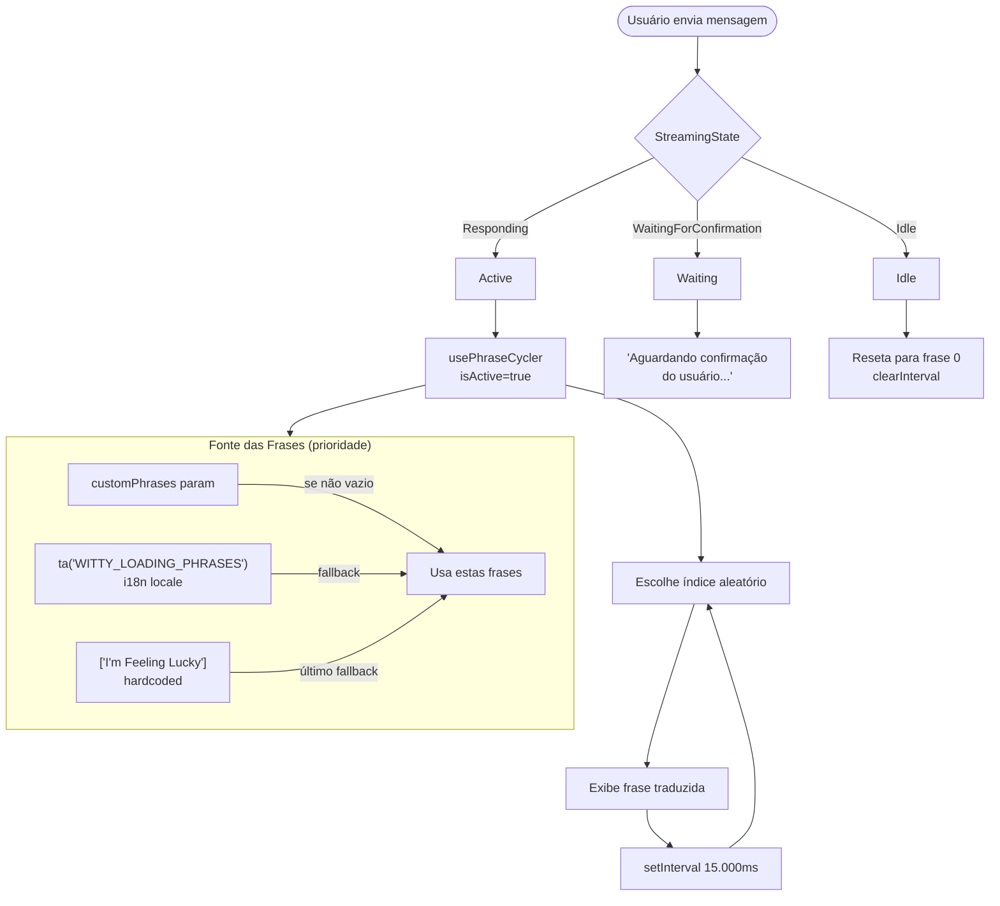
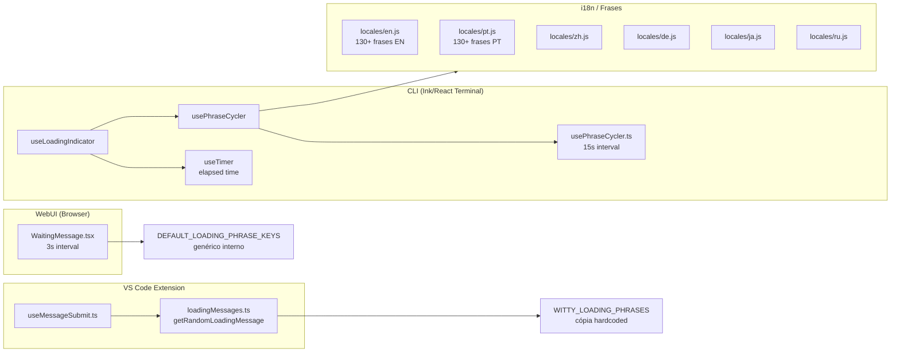
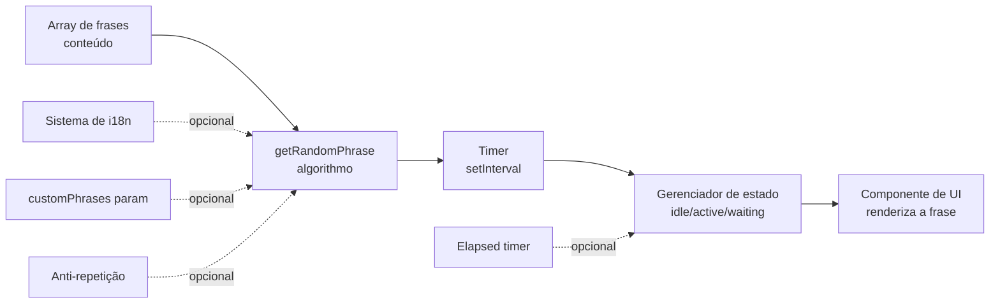

# Feedback System — Documento de Análise e Implementação

> Guia completo para reimplementar o sistema de frases de loading ("witty phrases") do qwen-code em outro sistema.

---

## 1. Visão Geral

### O que é

O **Feedback System** é o conjunto de mensagens exibidas ao usuário **enquanto o modelo está processando** uma resposta. Em vez de um spinner sem texto (ou nada), o sistema exibe frases humorísticas/técnicas que mudam automaticamente — tipo uma tela de loading de videogame.

Exemplos reais do sistema:

- `"Calibrando o capacitor de fluxo..."`
- `"Tentando sair do Vim..."`
- `"Convertendo café em código..."`
- `"Resolvendo dependências... e crises existenciais..."`
- `"O bolo não é uma mentira, está apenas carregando..."`

### Problema que resolve

| Problema                                            | Solução                                |
| --------------------------------------------------- | -------------------------------------- |
| Usuário não sabe se o sistema travou                | Texto que muda confirma que está ativo |
| Loading spinner genérico é entediante               | Frases com humor criam engajamento     |
| Sem feedback de estado (confirmação vs processando) | Frase específica para cada estado      |
| Experiência fria e técnica                          | Tom leve e humano enquanto espera      |

### Onde aparece

1. **CLI (terminal)** — footer da interface Ink enquanto `StreamingState === Responding`
2. **WebUI (browser)** — componente `WaitingMessage` dentro do chat
3. **Extensão VS Code** — mensagem de loading a cada request enviado

---

## 2. Arquitetura Completa do Sistema

### Diagrama de fluxo



### Diagrama de componentes por plataforma



---

## 3. Arquivos Críticos para Análise

### 3.1 Arquivos Obrigatórios (core do sistema)

| Arquivo                  | Caminho Completo                                                    | Responsabilidade                                                  |
| ------------------------ | ------------------------------------------------------------------- | ----------------------------------------------------------------- |
| `usePhraseCycler.ts`     | `packages/cli/src/ui/hooks/usePhraseCycler.ts`                      | **Coração do sistema CLI** — hook que gerencia ciclo de frases    |
| `useLoadingIndicator.ts` | `packages/cli/src/ui/hooks/useLoadingIndicator.ts`                  | Combina timer + frases, responde ao StreamingState                |
| `WaitingMessage.tsx`     | `packages/webui/src/components/messages/Waiting/WaitingMessage.tsx` | **Coração WebUI** — componente de loading do chat                 |
| `loadingMessages.ts`     | `packages/vscode-ide-companion/src/constants/loadingMessages.ts`    | **Coração VS Code** — frases e função `getRandomLoadingMessage()` |
| `locales/en.js`          | `packages/cli/src/i18n/locales/en.js` (linha 1192)                  | Fonte original das 130+ frases em inglês                          |
| `locales/pt.js`          | `packages/cli/src/i18n/locales/pt.js` (linha 1236)                  | Tradução PT das frases                                            |

### 3.2 Arquivos de Suporte (para entender o contexto)

| Arquivo                  | Caminho Completo                                                        | Responsabilidade                                            |
| ------------------------ | ----------------------------------------------------------------------- | ----------------------------------------------------------- |
| `Tips.tsx`               | `packages/cli/src/ui/components/Tips.tsx`                               | Dicas de uso na inicialização (sistema paralelo, diferente) |
| `InterruptedMessage.tsx` | `packages/webui/src/components/messages/Waiting/InterruptedMessage.tsx` | Estado "interrompido" (sem loading, só texto)               |
| `useGeminiStream.ts`     | `packages/cli/src/ui/hooks/useGeminiStream.ts`                          | Gerencia StreamingState que ativa o loading                 |
| `useMessageSubmit.ts`    | `packages/vscode-ide-companion/src/webview/hooks/useMessageSubmit.ts`   | Dispara `getRandomLoadingMessage()` ao enviar               |

### 3.3 Arquivo de Testes (comportamento esperado)

| Arquivo                   | Caminho Completo                                    | O que testar                          |
| ------------------------- | --------------------------------------------------- | ------------------------------------- |
| `usePhraseCycler.test.ts` | `packages/cli/src/ui/hooks/usePhraseCycler.test.ts` | Todos os casos de transição de estado |

---

## 4. Análise Detalhada por Componente

### 4.1 `usePhraseCycler` — CLI

**Arquivo:** `packages/cli/src/ui/hooks/usePhraseCycler.ts`

**Assinatura:**

```typescript
export const usePhraseCycler = (
  isActive: boolean, // true quando modelo está respondendo
  isWaiting: boolean, // true quando aguardando confirmação do usuário
  customPhrases?: string[], // opcional: frases customizadas (ex: subagents)
) => string // retorna a frase atual
```

**Constantes importantes:**

```typescript
export const PHRASE_CHANGE_INTERVAL_MS = 15000 // troca a cada 15 segundos
export const WITTY_LOADING_PHRASES: string[] = ["I'm Feeling Lucky"] // fallback hardcoded
```

**Máquina de estados interna:**

```
isWaiting=true  →  Frase fixa: "Waiting for user confirmation..."
                   clearInterval (para de ciclar)

isActive=true   →  Escolhe índice aleatório inicial
                   Inicia setInterval(15s) → troca aleatório

isActive=false  →  clearInterval
                   Reseta para frases[0]
```

**Prioridade das frases:**

```typescript
// 1. customPhrases (se não-vazio)
if (customPhrases && customPhrases.length > 0) return customPhrases

// 2. i18n (idioma do usuário)
const translated = ta('WITTY_LOADING_PHRASES')
if (translated.length > 0) return translated

// 3. Fallback hardcoded
return ["I'm Feeling Lucky"]
```

**Algoritmo de seleção aleatória:**

```typescript
// Ao ativar: índice aleatório inicial
const initialIndex = Math.floor(Math.random() * phrases.length)

// A cada 15s: novo índice aleatório (pode repetir)
const randomIndex = Math.floor(Math.random() * phrases.length)
```

---

### 4.2 `useLoadingIndicator` — Orquestrador CLI

**Arquivo:** `packages/cli/src/ui/hooks/useLoadingIndicator.ts`

**Função:** Combina timer de elapsed time + frases. É quem sabe sobre `StreamingState`.

```typescript
export const useLoadingIndicator = (
  streamingState: StreamingState,
  customWittyPhrases?: string[],
) => {
  elapsedTime: number,         // tempo decorrido em ms
  currentLoadingPhrase: string // frase atual
}
```

**Mapeamento StreamingState → comportamento:**

| StreamingState           | isActive | isWaiting | Timer                          |
| ------------------------ | -------- | --------- | ------------------------------ |
| `Responding`             | `true`   | `false`   | rodando                        |
| `WaitingForConfirmation` | `false`  | `true`    | congelado (retém último valor) |
| `Idle`                   | `false`  | `false`   | reset                          |

**Detalhe importante — retenção do timer:**

```typescript
// Ao entrar em WaitingForConfirmation: congela o tempo exibido
if (streamingState === WaitingForConfirmation) {
  setRetainedElapsedTime(elapsedTimeFromTimer)
}
// O usuário vê o tempo que levou até pedir confirmação
```

---

### 4.3 `WaitingMessage` — WebUI

**Arquivo:** `packages/webui/src/components/messages/Waiting/WaitingMessage.tsx`

**Diferença da implementação CLI:**

- Intervalo de **3s** (CLI usa 15s)
- Não usa sistema i18n completo, usa chaves de tradução simples
- Lógica anti-repetição: tenta evitar mostrar a mesma frase consecutivamente
- `loadingMessage` inicial vai primeiro na lista

```typescript
// Frases padrão (WebUI)
const DEFAULT_LOADING_PHRASE_KEYS = [
  'Processing...',
  'Working on it...',
  'Just a moment...',
  'Loading...',
  'Hold tight...',
  'Almost there...',
]
```

**Lógica anti-repetição:**

```typescript
// Ao trocar, garante frase diferente (até 5 tentativas)
let next = Math.floor(Math.random() * phrases.length)
let guard = 0
while (next === prev && guard < 5) {
  next = Math.floor(Math.random() * phrases.length)
  guard++
}
```

---

### 4.4 `loadingMessages.ts` — VS Code Extension

**Arquivo:** `packages/vscode-ide-companion/src/constants/loadingMessages.ts`

**Diferença das outras implementações:**

- Lista das 130+ frases duplicada aqui (cópia do CLI)
- Sem sistema i18n — inglês hardcoded
- Seleção aleatória a cada request, não por timer

```typescript
export const getRandomLoadingMessage = (): string =>
  WITTY_LOADING_PHRASES[Math.floor(Math.random() * WITTY_LOADING_PHRASES.length)]
```

**Como é usado:**

```typescript
// useMessageSubmit.ts:79
messageHandling.setWaitingForResponse(getRandomLoadingMessage())
// → ao enviar cada mensagem, escolhe 1 frase aleatória
// → exibe no WaitingMessage até resposta chegar
```

---

### 4.5 Sistema i18n das Frases

**Estrutura em cada arquivo de locale:**

```javascript
// packages/cli/src/i18n/locales/pt.js (linha 1236)
WITTY_LOADING_PHRASES: [
  'Estou com sorte',
  'Enviando maravilhas...',
  // ... ~130 frases
]
```

**Como as frases são acessadas:**

```typescript
// ta() = "translate array" — retorna array de strings traduzido
const translatedPhrases = ta('WITTY_LOADING_PHRASES')
```

**Idiomas disponíveis:** `en`, `pt`, `zh`, `de`, `ja`, `ru`

---

### 4.6 `Tips.tsx` — Sistema Paralelo (Inicialização)

**Arquivo:** `packages/cli/src/ui/components/Tips.tsx`

> **ATENÇÃO:** Este é um sistema **diferente** das frases de loading. Exibido **apenas na inicialização**, não durante o loading.

```typescript
// Dicas de uso (não piadas)
const startupTips = [
  'Use /compress when the conversation gets long...',
  'Start a fresh idea with /clear or /new...',
  'Use /bug to submit issues...',
  // ...8 dicas fixas
]

// Escolhe 1 aleatória na montagem do componente (useMemo → não troca)
const selectedTip = useMemo(() => {
  const randomIndex = Math.floor(Math.random() * startupTips.length)
  return startupTips[randomIndex]
}, [])
```

---

## 5. Fluxo de Dados End-to-End (CLI)

```
1. Usuário pressiona Enter
        │
        ▼
2. gemini.tsx dispara request ao modelo
   → streamingState = StreamingState.Responding
        │
        ▼
3. useLoadingIndicator(streamingState) ativa
   → isTimerActive = true (inicia contagem)
   → isPhraseCyclingActive = true
        │
        ▼
4. usePhraseCycler(isActive=true) ativa
   a. Chama ta('WITTY_LOADING_PHRASES') via i18n
   b. Recebe array de 130 frases no idioma do usuário
   c. Math.random() → índice aleatório inicial
   d. setCurrentLoadingPhrase(frases[índice])
   e. setInterval(15.000ms) → troca de frase a cada 15s
        │
        ▼
5. Footer/LoadingBar renderiza:
   "⠋ Calibrando o capacitor de fluxo... 12s"
        │
        ▼
6. [15 segundos depois]
   Intervalo dispara → nova frase aleatória
   "⠹ Tentando sair do Vim... 27s"
        │
        ▼
7. Modelo pede confirmação de tool
   → streamingState = WaitingForConfirmation
   → isWaiting = true
   → clearInterval (para de trocar)
   → frase fixa: "Aguardando confirmação do usuário..."
   → timer congela no valor atual
        │
        ▼
8. Usuário confirma → streamingState = Responding
   → timer reseta (novo request)
   → nova frase aleatória + novo intervalo
        │
        ▼
9. Modelo termina → streamingState = Idle
   → clearInterval
   → reseta para frases[0]
   → timer = 0
```

---

## 6. Como Reimplementar em Outro Sistema

### 6.1 Dados necessários

**O mínimo para funcionar:**

```typescript
// 1. Array de frases
const PHRASES = [
  'Calibrando o capacitor de fluxo...',
  'Tentando sair do Vim...',
  // ... quantas quiser
]

// 2. Função de seleção aleatória
const getRandomPhrase = () => PHRASES[Math.floor(Math.random() * PHRASES.length)]

// 3. Timer de rotação
let interval: NodeJS.Timeout | null = null

const startCycling = (onPhrase: (p: string) => void, intervalMs = 15000) => {
  onPhrase(getRandomPhrase()) // frase inicial
  interval = setInterval(() => onPhrase(getRandomPhrase()), intervalMs)
}

const stopCycling = () => {
  if (interval) {
    clearInterval(interval)
    interval = null
  }
}
```

**Para suporte a múltiplos estados:**

```typescript
type FeedbackState = 'idle' | 'responding' | 'waiting_confirmation'

const handleStateChange = (state: FeedbackState) => {
  if (state === 'responding') {
    startCycling(setCurrentPhrase)
  } else if (state === 'waiting_confirmation') {
    stopCycling()
    setCurrentPhrase('Aguardando confirmação...')
  } else {
    stopCycling()
    setCurrentPhrase('')
  }
}
```

### 6.2 Decisões de design a tomar

| Decisão            | Qwen Code                   | Alternativas a considerar                             |
| ------------------ | --------------------------- | ----------------------------------------------------- |
| Intervalo de troca | 15s (CLI), 3s (WebUI)       | Qualquer valor; 5-10s é confortável                   |
| Anti-repetição     | Não na CLI, sim na WebUI    | Recomendado implementar (evita repetir imediatamente) |
| i18n               | Sim (6 idiomas)             | Só EN se não tiver i18n                               |
| Personalização     | `customPhrases` param       | Útil para subagents/contextos especiais               |
| Estado especial    | Frase fixa para confirmação | Pode ter outros estados (erro, upload, etc.)          |
| Timer de elapsed   | Junto com frases            | Pode ser separado ou omitido                          |

### 6.3 Variações de Implementação por Plataforma

**React Hook (para CLI ou WebUI):**

```typescript
// Versão simplificada do usePhraseCycler
const useFeedbackPhrase = (isActive: boolean, phrases: string[]) => {
  const [phrase, setPhrase] = useState(phrases[0])

  useEffect(() => {
    if (!isActive) return

    const pick = () => setPhrase(phrases[Math.floor(Math.random() * phrases.length)])
    pick() // inicial

    const id = setInterval(pick, 15_000)
    return () => clearInterval(id)
  }, [isActive, phrases])

  return phrase
}
```

**Vanilla JS (sem React):**

```javascript
class FeedbackSystem {
  constructor(phrases, intervalMs = 15000) {
    this.phrases = phrases
    this.intervalMs = intervalMs
    this.interval = null
    this.onPhrase = null
  }

  start(callback) {
    this.onPhrase = callback
    this._pick()
    this.interval = setInterval(() => this._pick(), this.intervalMs)
  }

  stop() {
    clearInterval(this.interval)
    this.interval = null
  }

  setWaiting() {
    this.stop()
    this.onPhrase?.('Aguardando confirmação...')
  }

  _pick() {
    const i = Math.floor(Math.random() * this.phrases.length)
    this.onPhrase?.(this.phrases[i])
  }
}
```

**Python (para CLI Python):**

```python
import random
import threading

class FeedbackSystem:
    def __init__(self, phrases, interval_sec=15):
        self.phrases = phrases
        self.interval = interval_sec
        self._timer = None
        self._callback = None

    def start(self, callback):
        self._callback = callback
        self._tick()

    def stop(self):
        if self._timer:
            self._timer.cancel()
            self._timer = None

    def set_waiting(self):
        self.stop()
        if self._callback:
            self._callback("Aguardando confirmação...")

    def _tick(self):
        if self._callback:
            self._callback(random.choice(self.phrases))
        self._timer = threading.Timer(self.interval, self._tick)
        self._timer.daemon = True
        self._timer.start()
```

---

## 7. Conteúdo das Frases

### 7.1 Categorias temáticas (para criar novas)

As 130+ frases do qwen-code se dividem em:

| Categoria                  | Exemplos                                                        | Quantidade aprox. |
| -------------------------- | --------------------------------------------------------------- | ----------------- |
| Referências de programação | "Tentando sair do Vim...", "Reescrevendo em Rust..."            | ~20               |
| Sci-Fi / Cultura pop       | "Calibrando o capacitor de fluxo...", "Canalizando a Força..."  | ~25               |
| Games                      | "Aguardando o respawn...", "Pressionando 'A' para continuar..." | ~10               |
| Piadas de TI               | "Por que programadores preferem modo escuro? Bugs..."           | ~8                |
| Metáforas de processamento | "Convertendo café em código...", "Contando elétrons..."         | ~30               |
| Referências musicais       | "Nunca vou te entregar, nunca vou te decepcionar..."            | ~5                |
| Autocomprometimento        | "Debugando a realidade...", "Verificando erros no universo..."  | ~15               |
| Genérico aguarda           | "Quase lá...", "Só um momento..."                               | ~10               |

### 7.2 Onde copiar as frases completas

- **130+ frases em inglês:** `packages/cli/src/i18n/locales/en.js` (linha 1192)
- **130+ frases em PT-BR:** `packages/cli/src/i18n/locales/pt.js` (linha 1236)
- **Cópia VS Code (EN):** `packages/vscode-ide-companion/src/constants/loadingMessages.ts` (linha 11)

---

## 8. Testes Necessários

Baseado em `packages/cli/src/ui/hooks/usePhraseCycler.test.ts`, os casos obrigatórios são:

| Caso de teste                     | Comportamento esperado                         |
| --------------------------------- | ---------------------------------------------- |
| Inativo + não-aguardando          | Exibe frase inicial, não troca                 |
| Ativo                             | Exibe frase aleatória, troca no intervalo      |
| Transição para `waiting`          | Para de ciclar, frase fixa de confirmação      |
| Transição de `waiting` para ativo | Reinicia ciclagem com nova frase aleatória     |
| `customPhrases` fornecido         | Usa as frases customizadas, não as padrão      |
| `customPhrases` vazio `[]`        | Fallback para frases padrão                    |
| Unmount/destruição                | clearInterval executado (sem memory leak)      |
| Anti-repetição (WebUI)            | Frase diferente da anterior (máx 5 tentativas) |

---

## 9. Riscos e Considerações

| Risco                                        | Impacto | Mitigação                                             |
| -------------------------------------------- | ------- | ----------------------------------------------------- |
| Memory leak se clearInterval não for chamado | Alto    | Sempre retornar cleanup no useEffect / usar destrutor |
| Frase repetida imediatamente                 | Baixo   | Implementar lógica anti-repetição (guard loop)        |
| Frases culturalmente inadequadas             | Médio   | Revisar frases com equipe local antes de usar         |
| Intervalo muito rápido                       | Médio   | < 5s tende a distrair; mínimo recomendado: 5-8s       |
| Intervalo muito lento                        | Baixo   | > 30s parece travado; máximo recomendado: 20s         |
| Sem i18n (inglês hardcoded)                  | Médio   | OK para MVP; planejar tradução se for multilíngue     |

---

## 10. Checklist de Implementação

### MVP (mínimo funcional)

- [ ] Array de frases (mínimo 10-20 para variedade)
- [ ] Função `getRandomPhrase()` com `Math.random()`
- [ ] Ativar ciclagem ao iniciar request
- [ ] Desativar ciclagem ao receber resposta
- [ ] Limpar timer ao destruir componente

### Completo (paridade com qwen-code)

- [ ] Estado `waiting_confirmation` com frase fixa
- [ ] Suporte a `customPhrases` opcional
- [ ] Sistema i18n com frases traduzidas
- [ ] Anti-repetição (lógica guard loop)
- [ ] Timer de elapsed time junto com frase
- [ ] Separação CLI vs WebUI (intervalos diferentes)
- [ ] Testes cobrindo todos os estados
- [ ] Sistema de Tips separado (inicialização)

---

## 11. Mapa de Dependências para Implementação



**Ordem de implementação recomendada:**

1. Array de frases → `getRandomPhrase()`
2. Timer com start/stop
3. Integração com estado da stream (ativo/inativo)
4. Componente de UI
5. Estado especial de confirmação
6. i18n (se necessário)
7. customPhrases + anti-repetição
8. Testes
